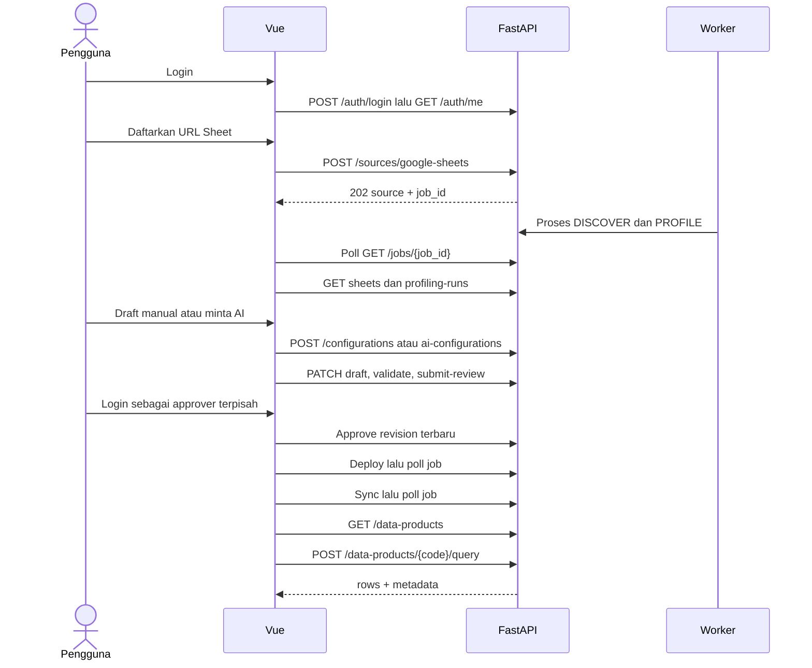

# API Reference untuk frontend

Versi backend **0.1.0** · berdasarkan implementasi yang diperiksa pada **9 September 2026**.

Dokumen ini menjelaskan **145 operasi HTTP yang sudah terdaftar di backend**, bukan seluruh endpoint yang pernah disebut pada dokumen rancangan. Contoh memakai data fiktif; UUID, kode produk, dan token harus diganti dengan hasil API lingkungan tujuan. Kehadiran endpoint tidak berarti database, Google, OpenAI, atau worker lingkungan tujuan sudah siap.

## Navigasi

- [Panduan implementasi frontend BE-12: field, state UI, error, XLSX, dan payload siap pakai](FRONTEND_BE12.md)

- [Konvensi, autentikasi, dan hak akses](#1-konvensi-umum)
- [Autentikasi dan pengguna](#2-autentikasi-dan-pengguna)
- [Google Sheets dan profiling](#3-google-sheets-dan-profiling)
- [Konfigurasi ETL dan approval](#4-konfigurasi-etl-dan-approval)
- [Job, ETL, dan kualitas data](#5-job-etl-dan-kualitas-data)
- [Katalog, query, dan laporan](#6-katalog-query-dan-laporan)
- [NL2SQL dan klarifikasi](#7-nl2sql-dan-klarifikasi)
- [Audit, penggunaan AI, dan health](#8-audit-penggunaan-ai-dan-health)
- [Alur implementasi Vue](#9-alur-implementasi-vue)
- [Error dan keterbatasan](#10-error-dan-keterbatasan)
- [Schema lengkap per field dan parameter endpoint](api/SCHEMAS.md)
- [Contoh semua payload request dalam JSON](api/PAYLOADS.json)
- [Snapshot OpenAPI untuk tooling](api/openapi.json)

`SCHEMAS.md` mencantumkan tipe, required, nullable, default, enum, regex, batas panjang/jumlah, parameter path/query, dan kolom record respons. Penjelasan bisnis serta bentuk `data`/`meta` tersedia di dokumen ini. Snapshot OpenAPI berasal dari aplikasi; sebagian besar responsnya masih `Envelope` dengan `data: any`, sehingga hasil code generation perlu dilengkapi tipe domain dari reference ini.

## 1. Konvensi umum

### Base URL dan dokumentasi runtime

Contoh lokal:

```text
Origin:           http://127.0.0.1:8000
Base API:         http://127.0.0.1:8000/api/v1
Swagger:          http://127.0.0.1:8000/docs
ReDoc:            http://127.0.0.1:8000/redoc
OpenAPI runtime:  http://127.0.0.1:8000/openapi.json
```

Path pada tabel endpoint di bawah relatif terhadap `/api/v1`, **kecuali `/health...` yang langsung di origin**. Prefix bisa diubah melalui `API_V1_PREFIX`. Saat ini `status_url` hasil enqueue masih hardcoded `/api/v1/jobs/{id}`; jika prefix diubah, frontend sebaiknya membentuk URL polling dari base API dan `job_id`.

Request JSON memakai `Content-Type: application/json`. Endpoint tanpa body tidak memerlukan `{}`. Tidak ada upload multipart/XLSX untuk pendaftaran sumber: kirim URL/ID Google Sheet.

```http
Authorization: Bearer ACCESS_TOKEN
Content-Type: application/json
Accept: application/json
```

### Envelope respons

Respons sukses JSON, termasuk `201` dan `202`:

```json
{
  "status": "success",
  "data": {},
  "meta": {},
  "errors": []
}
```

Respons error:

```json
{
  "status": "error",
  "data": null,
  "meta": {"request_id": "33333333-3333-4333-8333-333333333333"},
  "errors": [
    {
      "code": "VALIDATION_ERROR",
      "message": "Periksa parameter permintaan.",
      "details": [{"field": "body.username", "message": "Field required"}]
    }
  ]
}
```

`errors[].details` dapat `null`. Jangan bergantung pada teks `message` untuk branching; gunakan HTTP status dan `code`. Header `X-Request-ID` tersedia untuk korelasi; sukses tidak otomatis mempunyai `meta.request_id`. Error `401` juga mengirim `WWW-Authenticate: Bearer`.

Contoh respons yang diberi label **isi `data`** di bagian berikut adalah bagian dalam envelope, bukan seluruh body HTTP. Tabel `Data respons` selalu mengacu pada `response.data.data` jika memakai Axios. Respons download sukses adalah binary/teks CSV tanpa envelope; error download tetap envelope JSON.

### Tipe, ID, dan pagination

- UUID dikirim sebagai string. `sheet_id` Google berupa integer, berbeda dari `SourceSheet.id`/`source_sheet_id` yang UUID internal.
- Tanggal memakai `YYYY-MM-DD`. Timestamp metadata berupa ISO 8601 dengan zona waktu; frontend boleh mengubah tampilan ke zona pengguna. Cron memakai UTC.
- JSON boolean adalah `true`/`false`. Request tidak menerima `tenant_id` bebas; tenant diambil dari login/token dan database pengguna.
- Decimal/numeric hasil query diserialisasi sebagai angka JSON. Untuk nominal yang memerlukan presisi desimal tinggi, jangan mengasumsikan aritmetika JavaScript Number selalu presisi; backend belum menyediakan kontrak uang integer minor-unit.
- Payload menggunakan strict schema: field JSON yang tidak dikenal menghasilkan `422`. Field yang boleh dihilangkan belum tentu boleh berisi `null`; ikuti schema.
- List yang mempunyai `offset`/`limit`: default `0`/`100`, minimum offset `0`, limit `1..100`; respons `meta` berisi offset dan limit, **tanpa total count**. Urutan repository umumnya `created_at DESC`.
- List tanpa parameter pagination pada tabel tidak menerima pagination yang berfungsi. Beberapa dibatasi internal 100 item; jangan membuat infinite scroll dengan asumsi semua list mendukung offset.
- Belum ada pencarian/filter list generik, `DELETE`, pagination cursor, WebSocket, SSE, atau cancel-job endpoint.

### Hak akses

Singkatan di tabel:

| Kode | Role yang diizinkan |
|---|---|
| Public | Tanpa bearer token |
| Auth | Semua user aktif yang terautentikasi; akses produk tetap diperiksa |
| A | `PLATFORM_ADMIN` |
| E | `PLATFORM_ADMIN`, `SOURCE_OWNER`, `DATA_STEWARD` |
| R | `PLATFORM_ADMIN`, `TECHNICAL_APPROVER` |
| S | Gabungan E dan R |
| D | `PLATFORM_ADMIN`, `DATA_STEWARD` |

Role UI bukan hierarki bebas: misalnya `TECHNICAL_APPROVER` dapat approve tetapi tidak membuat source. Admin tetap dibatasi tenant sendiri. Untuk query, user harus tercantum pada `allowed_roles` produk/template; admin tidak otomatis melewati allowlist tersebut. Row scope pengguna berlaku pada query dan ekspor; `{"SALES":{"branch_name":[]}}` tidak mengizinkan baris, sedangkan `{}` berarti tidak ada tambahan pembatasan baris.

## 2. Autentikasi dan pengguna

| Method | Path | Hak | Body | HTTP sukses | Data respons |
|---|---|---|---|---|---|
| POST | `/auth/login` | Public | LoginRequest | 200 | TokenPair |
| POST | `/auth/refresh` | Public | RefreshRequest | 200 | TokenPair baru |
| GET | `/auth/me` | Auth | — | 200 | User public |
| POST | `/auth/logout` | Auth | — | 200 | `{message: string}` |
| POST | `/auth/change-password` | Auth | PasswordChange | 200 | `{message: string}` |
| POST | `/users` | A | UserCreate | 201 | User public |
| GET | `/users` | A | —; query offset/limit | 200 | User public[]; meta pagination |
| PATCH | `/users/{user_id}` | A | UserUpdate | 200 | User public |

### Login, refresh, dan logout

Login adalah JSON biasa, bukan OAuth form:

```json
{"tenant_code":"default","username":"admin","password":"PASSWORD_LOGIN_ANDA"}
```

Respons lengkap:

```json
{
  "status": "success",
  "data": {
    "access_token": "ACCESS_TOKEN",
    "refresh_token": "REFRESH_TOKEN",
    "token_type": "bearer"
  },
  "meta": {},
  "errors": []
}
```

Tidak ada field `expires_in`, user, atau cookie login pada respons. Panggil `/auth/me` setelah login. Lifetime default access 30 menit dan refresh 7 hari, bisa diubah server. Frontend dapat membaca claim `exp` untuk menjadwalkan refresh, tetapi keputusan autentikasi tetap di backend.

Refresh body:

```json
{"refresh_token":"REFRESH_TOKEN_TERAKHIR"}
```

Refresh token **sekali pakai dan dirotasi**: simpan kedua token baru, jangan memakai refresh lama lagi. Jika beberapa request mendapat 401 bersamaan, lakukan satu refresh bersama (single-flight), lalu retry request yang memang ditolak autentikasi satu kali. Jika refresh gagal, hapus session dan arahkan login. Jangan me-refresh berulang untuk 403/422 atau otomatis mengulangi mutation yang timeout tanpa mengetahui apakah sudah berhasil.

Logout menaikkan token version akun dan mencabut **semua token akun**, bukan hanya tab browser saat ini. Ubah password juga mencabut token dan meminta login ulang.

PasswordChange:

```json
{"current_password":"PASSWORD_LAMA_ANDA","new_password":"PASSWORD_BARU_MINIMAL_12_KARAKTER"}
```

Contoh isi `data` User public:

```json
{
  "id": "11111111-1111-4111-8111-111111111111",
  "tenant_id": "aaaaaaaa-aaaa-4aaa-8aaa-aaaaaaaaaaaa",
  "created_at": "2026-09-08T08:00:00Z",
  "username": "viewer_jakarta",
  "full_name": "Viewer Cabang Jakarta",
  "role": "VIEWER",
  "is_active": true,
  "row_scope": {"SALES": {"branch_name": ["Jakarta"]}}
}
```

### Administrasi pengguna

UserCreate:

```json
{
  "username": "viewer_jakarta",
  "password": "PASSWORD_AWAL_MINIMAL_12_KARAKTER",
  "full_name": "Viewer Cabang Jakarta",
  "role": "VIEWER",
  "row_scope": {"SALES": {"branch_name": ["Jakarta"]}}
}
```

Username 3–100 karakter, pola `^[a-zA-Z0-9_.@-]+$`. Password baru 12–256 karakter. Default role `VIEWER`, nama lengkap `""`, row_scope `{}`.

PATCH hanya mendukung `role`, `is_active`, dan `row_scope`; bukan username, full_name, atau password. Field yang tidak dikirim/bernilai null dilewati. Map row_scope diganti utuh, bukan deep merge. Update mencabut token user tersebut. Admin tidak boleh menonaktifkan atau mengubah role dirinya sendiri (`SELF_LOCKOUT`). Tidak ada endpoint reset password user lain saat ini.

## 3. Google Sheets dan profiling

| Method | Path | Hak | Body / parameter | HTTP sukses | Data respons |
|---|---|---|---|---|---|
| POST | `/sources/google-sheets` | E | SourceCreate | 202 | `{source: DataSource, ...EnqueuedJob}` |
| GET | `/sources` | S | offset/limit | 200 | DataSource[]; meta pagination |
| GET | `/sources/{source_id}` | S | UUID source | 200 | DataSource |
| GET | `/sources/{source_id}/sheets` | S | UUID source | 200 | SourceSheet[] |
| GET | `/source-sheets/{sheet_id}/classification` | S | Tidak ada | 200 | SheetClassification: kind, status, revision, actor/time, execution_ready, blocker |
| PUT | `/source-sheets/{sheet_id}/classification` | E | SheetClassificationUpdate | 200 | SheetClassification terbaru |
| PATCH | `/source-sheets/{sheet_id}` | E | SheetUpdate | 200 | SourceSheet |
| POST | `/sources/{source_id}/discover` | E | — | 202 | EnqueuedJob |
| POST | `/sources/{source_id}/profile` | E | — | 202 | EnqueuedJob |
| POST | `/sources/{source_id}/sync` | E | — | 202 | EnqueuedJob legacy; response menandai `review_required=true` dan merekomendasikan `sync-review` |
| POST | `/sources/{source_id}/sync-review` | E | — | 202 | batch review per tab; tab belum siap dikembalikan sebagai BLOCKED |
| GET | `/sources/{source_id}/master-migration-preview` | S | — | 200 | preview tab MASTER, binding, validation, migration_ready, rollback_plan; tidak destruktif |
| POST | `/sources/{source_id}/ai-configurations` | E | AIConfigurationRequest | 202 | EnqueuedJob |
| GET | `/source-sheets/{sheet_id}/configurations` | S | UUID tab internal | 200 | Configuration[]; maksimal 100 |
| GET | `/source-sheets/{sheet_id}/configurations/active` | S | UUID tab internal | 200 | Configuration atau null |
| GET | `/sources/{source_id}/profiling-runs` | S | UUID source | 200 | ProfilingRun[]; maksimal 100 |
| GET | `/sources/{source_id}/profiling-runs/{run_id}` | S | UUID source + profile | 200 | ProfilingRun |

### Mendaftarkan Sheet

```json
{
  "source_code": "sales_cabang",
  "name": "Penjualan Cabang",
  "spreadsheet_url": "https://docs.google.com/spreadsheets/d/ID_SPREADSHEET_ANDA/edit",
  "description": "Satu baris per transaksi penjualan",
  "credential_ref": "default",
  "sync_schedule": "0 */6 * * *"
}
```

`source_code` wajib unik per tenant, 1–63 karakter, lowercase identifier mulai huruf. `name` wajib 1–200 karakter. URL juga boleh berupa spreadsheet ID. Deskripsi maksimal 2000 karakter. `credential_ref` harus cocok dengan konfigurasi server; jangan mengirim email Service Account/private key. Cron lima field, optional/null untuk tanpa jadwal. Belum tersedia PATCH source untuk mengubah URL, deskripsi, atau jadwal setelah pendaftaran.

Contoh respons `202` lengkap:

```json
{
  "status": "success",
  "data": {
    "source": {
      "id": "11111111-1111-4111-8111-111111111111",
      "tenant_id": "aaaaaaaa-aaaa-4aaa-8aaa-aaaaaaaaaaaa",
      "created_at": "2026-09-08T08:00:00Z",
      "source_code": "sales_cabang",
      "name": "Penjualan Cabang",
      "spreadsheet_id": "ID_SPREADSHEET_ANDA",
      "description": "Satu baris per transaksi penjualan",
      "owner_user_id": "bbbbbbbb-bbbb-4bbb-8bbb-bbbbbbbbbbbb",
      "credential_ref": "default",
      "status": "DISCOVERED",
      "sync_schedule": "0 */6 * * *",
      "paused": false,
      "last_scheduled_at": null
    },
    "job_id": "33333333-3333-4333-8333-333333333333",
    "status": "QUEUED",
    "status_url": "/api/v1/jobs/33333333-3333-4333-8333-333333333333"
  },
  "meta": {},
  "errors": []
}
```

Simpan `source.id` dan `job_id`. Pendaftaran belum membuktikan akses ke Google berhasil; worker DISCOVER membaca metadata lalu langsung menjalankan profiling. Tunggu job selesai sebelum menampilkan tab. Error source_code duplikat adalah `409 RESOURCE_CONFLICT`; registrasi ulang bukan mekanisme update master.

### Mengatur tab dan profiling

Contoh SourceSheet, isi `data` satu item:

```json
{
  "id": "22222222-2222-4222-8222-222222222222",
  "tenant_id": "aaaaaaaa-aaaa-4aaa-8aaa-aaaaaaaaaaaa",
  "created_at": "2026-09-08T08:00:02Z",
  "source_id": "11111111-1111-4111-8111-111111111111",
  "sheet_id": 0,
  "sheet_name": "Sales",
  "range_a1": "A:CV",
  "header_row": 1,
  "data_start_row": 2,
  "enabled": true,
  "last_fingerprint": "HASH_SCHEMA",
  "active_configuration_id": null
}
```

SheetUpdate:

```json
{"range_a1":"A:D","header_row":1,"data_start_row":2,"enabled":true}
```

Semua field PATCH opsional. Header 1–100, awal data 2–1000 dan harus setelah header. Range berupa kolom kapital seperti `A:D` atau `A1:D500`; bila angka baris awal dicantumkan, adapter mengharuskan 1. Jangan menyertakan nama tab pada range. Batas default Google 50.000 baris data dan 100 kolom dapat diubah server.

PATCH tab yang sudah punya konfigurasi aktif ditolak `409 CONFIGURATION_CONFLICT`, termasuk perubahan `enabled`. PATCH tab mereset fingerprint; jalankan `/profile` kembali sebelum membuat konfigurasi.

Hasil job DISCOVER/PROFILE pada `Job.result`:

```json
{
  "profiles": [
    {
      "profiling_run_id": "44444444-4444-4444-8444-444444444444",
      "source_sheet_id": "22222222-2222-4222-8222-222222222222",
      "snapshot_id": "55555555-5555-4555-8555-555555555555"
    }
  ],
  "schema_drift": false
}
```

ProfilingRun mempunyai metadata record dan `source_id`, `source_sheet_id`, `fingerprint`, `status`, `profile_json`. Isi `profile_json`:

```json
{
  "sheet_name": "Sales",
  "header_row": 1,
  "range_a1": "A:D",
  "row_count": 3,
  "sample_size": 3,
  "columns": [
    {
      "source_column": "ID",
      "normalized_name": "id",
      "inferred_type": "text",
      "null_ratio": 0.0,
      "distinct_ratio": 1.0,
      "pii_suspected": false,
      "sample_masked": ["[REDACTED]", "[REDACTED]", "[REDACTED]"]
    }
  ],
  "fingerprint": "HASH_SCHEMA",
  "warnings": ["Review inferred types and PII classification before approval."]
}
```

Contoh kolom disingkat menjadi satu. Profiling menyamarkan semua sampel; tidak menyediakan preview raw Sheet pada endpoint ini. Pilih profile terbaru yang `source_sheet_id`-nya sesuai tab, bukan sekadar item pertama seluruh source.

AIConfigurationRequest:

```json
{"source_sheet_id":"22222222-2222-4222-8222-222222222222"}
```

Setelah job AI_CONFIG sukses, `result` berisi `{configuration_id, status: "AI_DRAFT"}`; ambil konfigurasi lewat GET. AI memakai metadata/profile, belum memeriksa typo semua nilai sel atau membentuk referensi master.


## Batch review import (BE-05–BE-07)

Kontrak lengkap, respons, state machine, idempotency, polling, checkpoint, dan error: [Batch review import BE-05](IMPORT_REVIEW_BE05.md). E = editor, S = editor/reviewer, R = reviewer. Batch memakai snapshot tersimpan. Preview mengikat snapshot, revision, dan isi perubahan melalui `preview_token`; approval wajib reviewer terpisah bila kebijakan tersebut aktif.

| Method | Path | Role | Payload / parameter | Status | Data |
|---|---|---|---|---|---|
| POST | `/import-reviews` | E | ImportReviewCreate | 202 | review, reused |
| GET | `/import-reviews` | S | status, source_sheet_id, offset, limit | 200 | items[], has_more |
| GET | `/import-reviews/{review_id}` | S | UUID batch | 200 | batch, dependencies_current, execution_ready=false |
| GET | `/import-reviews/{review_id}/findings` | S | offset, limit | 200 | items[], has_more |
| POST | `/import-reviews/{review_id}/cancel` | E | ImportReviewAction | 200 | batch CANCELLED |
| POST | `/import-reviews/{review_id}/revalidate` | E | ImportReviewAction | 200 | batch VALIDATING atau STALE_REVIEW |
| POST | `/import-reviews/{review_id}/resume` | E | ImportReviewAction | 200 | batch VALIDATING jika blocker sudah diselesaikan |
| GET | `/import-reviews/{review_id}/questions` | S | status, category, offset, limit | 200 | items[], has_more |
| POST | `/import-reviews/{review_id}/questions/{question_id}/answer` | E | ImportQuestionDecision | 200 | question, review; stale=true jika dependency berubah |
| POST | `/import-reviews/{review_id}/questions/{question_id}/resolve-master-proposal` | R | ImportProposalResolution | 200 | question, review setelah master aktif-approved |
| POST | `/import-reviews/{review_id}/preview` | E | ImportReviewPreviewRequest | 200 | target, changes[], summary, preview_hash, preview_token, can_approve |
| GET | `/import-reviews/{review_id}/preview` | S | Tanpa body | 200 | Preview editor tervalidasi ulang, masked_fields, read_only; tanpa token apply |
| POST | `/import-reviews/{review_id}/approve` | R | ImportReviewApproveRequest | 200 | review APPROVED |
| POST | `/import-reviews/{review_id}/apply` | E | ImportReviewApplyRequest | 200 | review SUCCEEDED, rows_applied |
| POST | `/import-reviews/{review_id}/resolve-reference` | S | ImportReferenceResolveRequest | 200 | ALIAS, EXACT, CANDIDATE, AMBIGUOUS, atau NOT_FOUND; EXACT dapat mengisi staging secara eksplisit |

Urutan untuk frontend: tunggu batch bebas dari `blocking_codes`, panggil `preview`, tampilkan before/after per baris, minta approval reviewer, kemudian kirim token preview yang sama ke `apply`. Checkpoint AI menyimpan `ai_coverage`, `ai_reviewed_rows`, `ai_masked_fields`, dan `ai_metadata`; field PII MEDIUM/HIGH dikirim sebagai `[REDACTED]`. Jika revision, snapshot, konfigurasi, atau target berubah, backend mengembalikan `409 IMPORT_PREVIEW_STALE` dan frontend harus membuat preview baru. Apply memakai UPSERT berdasarkan business key dan seluruh baris diproses dalam transaksi request.

## Storage master kanonis (BE-04)

Kontrak lengkap dan mekanisme deployment: [Storage master BE-04](STORAGE_MASTER_BE04.md). S = editor/reviewer, R = reviewer. Seluruh endpoint berikut mengembalikan 200 dengan envelope standar. Tidak ada endpoint publik untuk menulis record atau melewati review import.

| Method | Path | Role | Payload / parameter | Status | Data |
|---|---|---|---|---|---|
| GET | `/master-definitions/{master_id}/storage-plan` | S | UUID master | 200 | target, master_version, revision_no, ddl, schema_policy, execution_ready=false |
| POST | `/master-definitions/{master_id}/deploy-storage` | R | MasterRevisionRequest | 200 | target, master_version, storage_ready=true, execution_ready=false |
| GET | `/master-definitions/{master_id}/records` | S | search, offset, limit, active_only, record_id, as_of | 200 | items[], has_more, masked_fields[] |

## Registry master dan binding sumber (BE-03)

Metadata master dan binding kini tersedia; kontrak lengkap, payload, respons, versioning, dan error ada di [Registry master BE-03](REGISTRY_MASTER_BE03.md). Storage kanonis tersedia pada BE-04; pemuatan master masih menunggu review/apply import. Semua body baru tersedia di PAYLOADS.json dan SCHEMAS.md.

| Method | Path | Hak | Body / query | HTTP sukses | Data respons |
|---|---|---|---|---|---|
| GET | `/master-definitions` | S | search, offset, limit | 200 | MasterDefinition[] |
| POST | `/master-definitions/preview` | E | MasterDefinitionCreate; against opsional | 200 | candidates[], creates_master=false |
| POST | `/master-definitions` | E | MasterDefinitionCreate | 201 | MasterDefinition draft |
| GET | `/master-definitions/{master_id}` | S | UUID master | 200 | MasterDefinition |
| PATCH | `/master-definitions/{master_id}` | E | MasterDefinitionPatch | 200 | MasterDefinition draft revisi baru |
| POST | `/master-definitions/{master_id}/submit-review` | E | MasterRevisionRequest | 200 | MasterDefinition NEEDS_REVIEW |
| POST | `/master-definitions/{master_id}/approve` | R | MasterRevisionRequest | 200 | MasterDefinition APPROVED, versi approved baru |
| POST | `/master-definitions/{master_id}/reject` | R | MasterRevisionRequest | 200 | MasterDefinition REJECTED |
| POST | `/master-definitions/{master_id}/deactivate` | R | MasterRevisionRequest | 200 | MasterDefinition INACTIVE |
| GET | `/source-sheets/{sheet_id}/master-binding` | S | UUID tab | 200 | binding/null, validation, metadata_ready, execution_ready=false, blocking_reason |
| PUT | `/source-sheets/{sheet_id}/master-binding` | E | MasterBindingUpdate | 200 | binding, validation, execution_ready=false |
| POST | `/source-sheets/{sheet_id}/master-binding/approve` | R | MasterRevisionRequest | 200 | MasterSourceBinding APPROVED |
| POST | `/source-sheets/{sheet_id}/master-binding/reject` | R | MasterRevisionRequest | 200 | MasterSourceBinding REJECTED |
| GET | `/source-sheets/{sheet_id}/column-bindings` | S | UUID tab | 200 | daftar binding kolom ke master |
| GET | `/source-sheets/{sheet_id}/column-bindings/recommendations` | S | UUID tab | 200 | kandidat binding berbobot; `requires_confirmation=true` |
| PUT | `/source-sheets/{sheet_id}/column-bindings` | E | MasterColumnBindingCreate | 200 | binding kolom draft dengan revision baru |
| POST | `/column-bindings/{binding_id}/approve` | R | MasterRevisionRequest | 200 | binding kolom APPROVED |
| POST | `/column-bindings/{binding_id}/reject` | R | MasterRevisionRequest | 200 | binding kolom REJECTED |
| GET | `/master-definitions/dependency-plan` | S | Tidak ada | 200 | nodes, edges (termasuk target_table/target_column), load_order, has_cycle, correction_actions, execution_ready |
| GET | `/master-definitions/reference-orphans` | S | Tidak ada | 200 | items per binding, orphan_count, orphan_values, type validation, execution_ready |
| POST | `/master-definitions/deploy-foreign-keys` | R | Tidak ada | 200 | created constraints, execution_ready=true |

Klasifikasi MASTER sekarang ditahan oleh MASTER_RUNTIME_PENDING; GET master-binding yang belum mempunyai binding menggunakan MASTER_BINDING_REQUIRED. Binding metadata ready tidak memberi izin load. GET klasifikasi MASTER menambah ringkasan master_binding; field klasifikasi lainnya tetap seperti BE-02.

## 4. Konfigurasi ETL dan approval

**Status BE-02:** klasifikasi per tab sudah aktif melalui GET/PUT `/source-sheets/{sheet_id}/classification`. Body PUT adalah `{"revision_no":1,"dataset_kind":"NON_MASTER"}` atau `MASTER`. Payload policy lengkap BE-01 belum menjadi body API; SourceCreate/ETLConfiguration tetap tidak menerima dataset_kind. Registry/binding master tersedia pada BE-03; MASTER tetap tertahan sebelum review/apply import tersedia. Kontrak respons, error, serta dampak rollout dijelaskan di [Klasifikasi tab BE-02](KLASIFIKASI_TAB_BE02.md). BE-04 menambah storage/pencarian record, BE-05 batch review, dan BE-06 pertanyaan/keputusan sehingga jumlah operasi aktif menjadi 117.

| Method | Path | Hak | Body / query | HTTP sukses | Data respons |
|---|---|---|---|---|---|
| GET | `/configurations/parameter-catalog` | S | — | 200 | parameter runtime, tipe, default, supported, capabilities |
| POST | `/configurations` | E | ConfigurationCreate | 201 | Configuration |
| GET | `/configurations/{config_id}` | S | — | 200 | Configuration |
| PATCH | `/configurations/{config_id}` | E | ConfigurationPatch | 200 | Configuration |
| POST | `/configurations/{config_id}/validate` | S | — | 200 | ValidationResult |
| GET | `/configurations/{config_id}/review` | S | Tidak ada | 200 | ReviewDetail: configuration, source, sheet, profile, validation, capabilities |
| POST | `/configurations/{config_id}/workbook-preview` | E | WorkbookPreviewRequest | 200 | WorkbookPreview: can_apply, diff, errors, validation, preview_token |
| POST | `/configurations/{config_id}/workbook-apply` | E | WorkbookApplyRequest | 200 | Configuration draft revisi baru |
| POST | `/configurations/{config_id}/submit-review` | E | ReviewSubmission | 200 | Configuration |
| POST | `/configurations/{config_id}/approve` | R | Decision | 200 | Configuration |
| POST | `/configurations/{config_id}/reject` | R | Decision | 200 | Configuration |
| POST | `/configurations/{config_id}/clone` | E | — | 201 | Configuration baru |
| POST | `/configurations/{config_id}/activate` | R | — | 202 | EnqueuedJob; alias deploy |
| POST | `/configurations/{config_id}/deploy` | R | — | 202 | EnqueuedJob |
| POST | `/configurations/{config_id}/rollback` | R | — | 202 | EnqueuedJob |
| GET | `/configurations/{config_id}/artifacts` | S | — | 200 | Artifact[]; maksimal 100 |
| POST | `/configurations/{config_id}/export` | S | ExportRequest | 201 | Artifact |
| GET | `/configurations/{config_id}/artifacts/{artifact_id}/download` | S | — | 200 | File binary/teks tanpa envelope |
| GET | `/configurations/{config_id}/questions` | S | — | 200 | string[] pertanyaan |
| GET | `/configurations/{config_id}/diff` | S | `against` UUID wajib | 200 | map field → `{before, after}` |

## 5. Taxonomy (BE-13)

Mulai integrasi frontend dari [handoff BE-13 bertahap](FRONTEND_BE13.md) dan
[20 contoh payload per aksi](api/BE13_FRONTEND_PAYLOADS.json). Status tersedia di kode
tidak menyatakan deployment environment tujuan sudah selesai.

Taxonomy menyimpan kategori baku berversi dan term hierarkis. Editor membuat taxonomy/term dalam status `DRAFT`; reviewer mengubah taxonomy menjadi `APPROVED`. Binding kolom dan validasi `in_taxonomy` menggunakan versi approved.

| Method | Path | Hak | Body / query | HTTP sukses | Data respons |
|---|---|---|---|---|---|
| POST | `/taxonomies` | E | TaxonomyCreate | 201 | Taxonomy DRAFT |
| GET | `/taxonomies` | S | — | 200 | daftar taxonomy tenant |
| GET | `/taxonomies/{taxonomy_id}/terms` | S | UUID taxonomy | 200 | daftar term dan hierarchy |
| POST | `/taxonomies/{taxonomy_id}/terms` | E | TaxonomyTermCreate | 201 | TaxonomyTerm |
| POST | `/taxonomies/{taxonomy_id}/approve` | R | — | 200 | Taxonomy APPROVED dengan version baru |
| POST | `/taxonomies/{taxonomy_id}/versions` | E | TaxonomyVersionCreate | 201 | Draft versi berikutnya; retry mengembalikan draft sama |
| GET | `/taxonomies/{taxonomy_id}/versions` | S | offset, limit | 200 | Riwayat snapshot/draft terbaru dahulu, items dan has_more |
| GET | `/taxonomies/versions/{version_id}` | S | Tanpa body | 200 | TaxonomyVersion beserta definition_json.terms |
| PUT | `/taxonomies/versions/{version_id}` | E | TaxonomyVersionUpdate | 200 | Ganti seluruh term draft, revision bertambah |
| POST | `/taxonomies/versions/{version_id}/approve` | R | MasterRevisionRequest | 200 | Publikasi atomik; versi terbit immutable |
| POST | `/taxonomies/{taxonomy_id}/resolve-term` | S | TaxonomyTermResolveRequest | 200 | Resolusi exact/candidate/ambiguous/not found |
| POST | `/taxonomies/{taxonomy_id}/ambiguity-question` | E | TaxonomyAmbiguityQuestionRequest | 201 | Buat ImportQuestion untuk nilai taxonomy ambigu |
| POST | `/taxonomies/{taxonomy_id}/validate-values` | S | TaxonomyValuesValidateRequest | 200 | Validasi `in_taxonomy` dan versi taxonomy |
| POST | `/taxonomies/{taxonomy_id}/recommend-terms-ai` | E | TaxonomyAIRecommendRequest | 200 | Saran generatif dari term aktif; konfirmasi wajib |
| POST | `/taxonomies/{taxonomy_id}/recommend-terms` | S | TaxonomyRecommendRequest | 200 | Rekomendasi kandidat term berbasis kemiripan; selalu perlu konfirmasi |
| GET | `/taxonomies/source-sheets/{sheet_id}/column-bindings` | S | — | 200 | Binding taxonomy per kolom |
| PUT | `/taxonomies/source-sheets/{sheet_id}/column-bindings` | E | TaxonomyColumnBindingCreate | 200 | Simpan binding DRAFT (optimistic revision) |
| POST | `/taxonomies/column-bindings/{binding_id}/approve` | R | MasterRevisionRequest | 200 | Setujui binding taxonomy |
| POST | `/taxonomies/column-bindings/{binding_id}/reject` | R | MasterRevisionRequest | 200 | Tolak binding taxonomy |

Binding hanya boleh menunjuk taxonomy berstatus `APPROVED` dan `taxonomy_version` yang masih aktif. Perubahan binding selalu kembali ke `DRAFT`; reviewer wajib menyetujui ulang. `revision_no` mencegah dua editor menimpa perubahan.

`resolve-term` menormalisasi input dengan trim dan case-fold. Jika satu kode/label/alias cocok, respons berstatus `EXACT`. Jika exact tidak ditemukan, resolver mencari kandidat tambahan: satu kandidat menghasilkan `CANDIDATE`, beberapa menghasilkan `AMBIGUOUS`, dan tanpa kandidat menghasilkan `NOT_FOUND`. Hasil selain `EXACT` memakai `requires_question=true`. Frontend harus meminta pilihan pengguna sebelum menyimpan nilai yang bukan `EXACT`.

Endpoint `validate-values` dapat digunakan untuk pemeriksaan awal. Worker, dry-run, preview/apply, dan ETL langsung memvalidasi binding approved secara internal; pemanggilan endpoint oleh frontend bukan prasyarat validasi runtime.

Field taxonomy pada `ColumnMapping` bersifat opsional: `taxonomy_id` dan `taxonomy_version` menunjuk taxonomy approved, sedangkan `taxonomy_required=true` mewajibkan nilai lolos validasi sebelum apply.

`QualityRule` kini menerima `severity`, `owner`, `threshold_percent`, `max_age_days`, dan `default_value`. Parameter tersebut tersimpan dalam konfigurasi; compiler sudah menerapkan threshold/default sebagaimana dijelaskan di bawah.

Compiler ETL menerapkan `default_value` saat nilai kolom null dan menghentikan batch dengan `DQ_THRESHOLD_EXCEEDED` jika persentase kegagalan rule melewati `threshold_percent`.

### Payload konfigurasi

Contoh ConfigurationCreate lengkap yang valid secara schema:

```json
{
  "source_sheet_id": "22222222-2222-4222-8222-222222222222",
  "configuration": {
    "schema_version": "1.0",
    "dataset_business_name": "Penjualan Cabang",
    "dataset_description": "Data transaksi penjualan per cabang",
    "grain": "Satu baris per nomor transaksi",
    "target_schema": "trusted",
    "target_table": "sales_transaction",
    "load_strategy": "UPSERT",
    "columns": [
      {"source_column":"ID","target_column":"transaction_id","target_type":"text","nullable":false,"is_business_key":true,"transformation_codes":["trim"]},
      {"source_column":"Tanggal","target_column":"transaction_date","target_type":"date","nullable":false,"transformation_codes":["parse_date_id"]},
      {"source_column":"Cabang","target_column":"branch_name","target_type":"text","nullable":false,"transformation_codes":["trim"]},
      {"source_column":"Total","target_column":"net_amount","target_type":"numeric","nullable":false,"transformation_codes":["parse_decimal_id"]}
    ],
    "data_quality_rules": [
      {"column":"net_amount","rule":"min","value":0,"action_on_fail":"REJECT_ROW"}
    ],
    "semantic": {
      "code": "SALES",
      "dimensions": ["transaction_id", "transaction_date", "branch_name"],
      "metrics": [
        {"code":"net_sales","column":"net_amount","aggregation":"sum","label":"Penjualan bersih"},
        {"code":"transaction_count","column":"transaction_id","aggregation":"count","label":"Jumlah transaksi"}
      ],
      "allowed_roles": ["PLATFORM_ADMIN", "DATA_STEWARD", "ANALYST", "VIEWER"]
    },
    "unresolved_questions": [],
    "overall_confidence": 1
  }
}
```

`source_column` harus cocok persis dengan header hasil profiling. Business key tidak boleh nullable, dan UPSERT wajib mempunyai business key. `target_table` adalah awalan nama tabel (lowercase, maksimal 30 karakter), bukan SQL; compiler menambahkan UUID tab.

Aturan penting:

| Bagian | Aturan |
|---|---|
| `columns` | 1–100 mapping; nama source dan target harus unik |
| `target_type` | `text`, `varchar`, `integer`, `bigint`, `numeric`, `boolean`, `date`, `timestamp`, `timestamptz`, `uuid` |
| Transform | `trim`, `normalize_whitespace`, `parse_date_id`, `parse_decimal_id`, `uppercase`, `lowercase`, `null_if_empty`; urutan list adalah urutan eksekusi |
| PII | `NONE`, `LOW`, `MEDIUM`, `HIGH`; hanya NONE/LOW masuk semantic columns |
| DQ rule | `not_null`, `unique`, `min`, `max`, `allowed_values` |
| `action_on_fail` | `REJECT_ROW`, `WARN`, `STOP_BATCH`, `REQUIRE_REVIEW` |
| `semantic.dimensions` | Harus kolom mapped non-sensitif |
| `semantic.metrics` | Kode unik dan berbeda dari nama kolom; agregasi sum/avg hanya numerik |
| Agregasi | `sum`, `count`, `avg`, `min`, `max`, `count_distinct` |
| `unresolved_questions` | Semua pertanyaan harus diselesaikan sebelum approval/deploy |

`min/max` memerlukan angka pada `value`; allowed_values memakai list string. Simpan kode berawalan nol sebagai text. Jangan mengubah semua angka bertitik/koma dengan satu fungsi frontend; gunakan transform yang sesuai format sumber.

Strategi load: APPEND menambah baris dan mengabaikan konflik constraint; UPSERT memperbarui berdasarkan business key; FULL_REFRESH mengganti data tenant pada tabel target dan ditolak bila ada baris invalid. UPSERT saat ini tidak menyatukan master antar-Sheet.

### Bentuk Configuration dan revision

Configuration berisi metadata record, `source_id`, `source_sheet_id`, `version_no`, `revision_no`, `status`, `based_on_fingerprint`, `configuration_json`, `created_by`, `approved_by`, `approved_at`, `ai_response_id`, `ai_model`, `prompt_version`. Field approval/AI bisa null. `configuration_json` adalah objek ETLConfiguration di atas, termasuk default yang dinormalisasi server.

- `version_no`: versi konfigurasi untuk satu tab; naik saat create/clone.
- `revision_no`: revisi draft; naik saat PATCH, submit-review, approve/reject.
- Konfigurasi manual mulai `NEEDS_REVIEW`; hasil AI mulai `AI_DRAFT`.
- PATCH hanya untuk AI_DRAFT/NEEDS_REVIEW dan mengganti **seluruh** objek configuration. Ambil ulang GET sebelum edit dan gunakan revision terakhir.

Contoh mekanisme PATCH di TypeScript:

```ts
const { data: envelope } = await api.get(`/configurations/${configId}`)
const current = envelope.data
const edited = structuredClone(current.configuration_json)
// Ubah mapping atau aturan sesuai keputusan pengguna.
const question_answers = Object.fromEntries(
  current.configuration_json.unresolved_questions.map(q => [q, jawabanPengguna[q]])
)
edited.unresolved_questions = [] // Hanya sesudah jawaban dan konfigurasi terkait diperiksa.
await api.patch(`/configurations/${configId}`, {
  revision_no: current.revision_no,
  configuration: edited,
  question_answers,
})
```

GET questions hanya mengembalikan string[], misalnya `["Apakah ID unik per transaksi atau per cabang?"]`. Belum ada question_id atau keputusan per sel. Setiap pertanyaan yang dihapus dari daftar wajib mempunyai jawaban pada `question_answers` (key adalah teks pertanyaan persis). Jawaban tersimpan di `Configuration.review_state.answers` bersama user_id dan waktu. UI harus menyesuaikan konfigurasi sesuai jawaban. Menghapus teks pertanyaan saja bukan pemeriksaan data bisnis.

### Validasi, approval, dan deploy

BE-02 menambahkan `classification` serta `ready_for_review` pada ValidationResult. `valid` tetap menilai data/pertanyaan; gunakan `ready_for_review` untuk gate klasifikasi dan data sebelum submit. Submission menyimpan classification_revision/dataset_kind pada review_state. Approve/deploy/rollback memeriksa kesesuaiannya; sync memeriksa seluruh tab enabled dan worker mengecek ulang. Detail dan contoh lengkap ada di [kontrak BE-02](KLASIFIKASI_TAB_BE02.md).

ValidationResult, isi `data`:

```json
{
  "valid": true,
  "sample_rows_valid": 3,
  "sample_rows_invalid": 0,
  "warnings": [],
  "unresolved_questions": [],
  "snapshot_id": "77777777-7777-4777-8777-777777777777",
  "snapshot_hash": "aaaaaaaaaaaaaaaaaaaaaaaaaaaaaaaaaaaaaaaaaaaaaaaaaaaaaaaaaaaaaaaa",
  "row_previews": [],
  "issues": [],
  "deployment_plan": {
    "target": "trusted.sales_transaction_22222222222242228222222222222222",
    "semantic_view": "semantic.v_22222222222242228222222222222222",
    "ddl": "CREATE TABLE ...",
    "policy": "CREATE_ONLY_OR_IDENTICAL; schema changes require a reviewed migration"
  }
}
```

Nilai `ddl` di contoh dipersingkat; server mengirim SQL lengkap. Tampilkan hanya bila berguna bagi reviewer teknis. Walaupun nama field `sample_rows_*`, service memvalidasi snapshot terakhir yang tersimpan, bukan hanya kolom sample profil. Warnings maksimal 20 item pada respons, bentuk `{source_row, column, code}`. Beberapa aturan STOP_BATCH/REQUIRE_REVIEW melempar 422, bukan mengembalikan valid=false.

`200` dari validate/PATCH tidak otomatis berarti valid=true. Approve akan memeriksa validasi lagi. Deploy membaca ulang Sheet dan memeriksa fingerprint serta data terkini.

Urutan UI:

1. GET draft → edit → PATCH → validate.
2. Jika valid, submit-review dengan `revision_no`, `snapshot_hash` dari validasi, seluruh `reviewed_columns` (nama target), serta `reviewed_sections`: identity, columns, cleansing, quality, load, semantic. Gunakan revision_no dari respons submit untuk keputusan berikutnya. Checklist yang tidak lengkap ditolak server.
3. User R mengirim approve/reject:

```json
{"revision_no":2,"comment":"Mapping, business key, dan hasil validasi sudah diperiksa."}
```

4. Default `REQUIRE_SEPARATE_APPROVER=true`: pembuat/editor terakhir tidak boleh menyetujui draft sendiri, termasuk admin. Setelah PATCH, `created_by` menjadi editor tersebut.
5. Approve menghasilkan APPROVED dan runtime artifact. Ini belum ACTIVE.
6. Deploy/activate menerima APPROVED, mengantrekan job. Tunggu SUCCEEDED, lalu reload konfigurasi, tab aktif, dan katalog produk.

Aktivasi mengganti konfigurasi aktif sebelumnya menjadi SUPERSEDED. REJECTED/APPROVED/ACTIVE tidak bisa diedit langsung; clone menjadi draft baru. Perubahan fisik kolom/type/business key yang tidak identik memerlukan migrasi terpisah, bukan sekadar approval UI. Kode semantic product tidak boleh dipakai tab lain.

Rollback hanya menerima konfigurasi SUPERSEDED dan mengantrekan deployment versi itu setelah pemeriksaan. **Rollback ini mengganti konfigurasi aktif, bukan memulihkan isi data historis atau database backup.**

`GET diff?against=UUID` hanya membandingkan konfigurasi pada tab yang sama. Hasil berupa map field yang berbeda; `before`/`after` dapat berupa objek atau list.

### Artifact dan download

ExportRequest: `{"format":"JSON"}`, `{"format":"YAML"}`, atau `{"format":"XLSX"}`. Format default JSON, tetapi endpoint tetap mempunyai body request; kirim `{}` untuk default.

Contoh Artifact (isi `data`):

```json
{
  "id": "66666666-6666-4666-8666-666666666666",
  "tenant_id": "aaaaaaaa-aaaa-4aaa-8aaa-aaaaaaaaaaaa",
  "created_at": "2026-09-08T08:10:00Z",
  "configuration_version_id": "77777777-7777-4777-8777-777777777777",
  "artifact_type": "EXPORT_XLSX",
  "file_name": "config-v1.xlsx",
  "mime_type": "application/vnd.openxmlformats-officedocument.spreadsheetml.sheet",
  "content_hash": "HASH_SHA256_FILE",
  "file_size_bytes": 6000,
  "is_current": true
}
```

File JSON/YAML berisi metadata schema_version, configuration_id, configuration_version, tenant_id, source_id, source_sheet_id, dan configuration. XLSX mempertahankan 14 tab template, menambahkan `14 Review` dan `_ETL_Metadata` tersembunyi, serta mengisi subset konfigurasi yang dapat dieksekusi. Sel kuning dapat diedit; formula pada input, perubahan tab/referensi, atau parameter yang tidak didukung ditolak. Workbook terikat tenant, konfigurasi, revision, fingerprint, dan snapshot; identitas export berlaku 7 hari. Lihat [kontrak preview/apply](PANDUAN_REVIEW_ETL.md). `storage_uri` tidak diekspos. Untuk download, gunakan endpoint dengan ID artifact; jangan mengakses path filesystem.

## 5. Job, ETL, dan kualitas data

| Method | Path | Hak | Body / query | HTTP sukses | Data respons |
|---|---|---|---|---|---|
| GET | `/jobs` | S | offset/limit | 200 | Job[]; meta pagination |
| GET | `/jobs/{job_id}` | S | — | 200 | Job |
| POST | `/jobs/{job_id}/retry` | S | — | 202 | EnqueuedJob baru |
| GET | `/etl-jobs` | S | — | 200 | DataSource[]; maksimal 100 |
| POST | `/etl-jobs/{job_id}/run` | E | — | 202 | EnqueuedJob |
| POST | `/etl-jobs/{job_id}/pause` | E | — | 200 | DataSource |
| POST | `/etl-jobs/{job_id}/resume` | E | — | 200 | DataSource |
| GET | `/etl-runs` | S | offset/limit | 200 | ETLRun[]; meta pagination |
| GET | `/etl-runs/{run_id}` | S | — | 200 | ETLRun |
| GET | `/etl-runs/{run_id}/errors` | S | — | 200 | QualityIssue[] tanpa data mentah; maksimal 100 |
| GET | `/etl-runs/{run_id}/lineage` | S | offset/limit | 200 | Lineage; meta pagination |
| GET | `/data-quality/issues` | D | offset/limit | 200 | QualityIssue[] tanpa data mentah; meta pagination |
| POST | `/data-quality/issues/{issue_id}/resolve` | D | ResolutionRequest | 200 | QualityIssue tanpa data mentah |
| GET | `/quarantine/{source_id}/rows` | D | offset/limit | 200 | QualityIssue[] dengan data mentah; meta pagination |
| POST | `/quarantine/{source_id}/reprocess` | D | — | 202 | EnqueuedJob ETL |

**Perhatikan ID:** `{job_id}` pada `/etl-jobs/{job_id}/...` sebenarnya adalah **DataSource.id**, bukan ID dari `/jobs`. Gunakan source.id dari hasil `/etl-jobs`. Pause memengaruhi sumber/jadwal dan menolak sync saat source paused; bukan cancel job yang sudah berjalan.

### EnqueuedJob dan polling

EnqueuedJob, isi `data`:

```json
{
  "job_id": "33333333-3333-4333-8333-333333333333",
  "status": "QUEUED",
  "status_url": "/api/v1/jobs/33333333-3333-4333-8333-333333333333"
}
```

Job, isi `data` hasil GET:

```json
{
  "id": "33333333-3333-4333-8333-333333333333",
  "tenant_id": "aaaaaaaa-aaaa-4aaa-8aaa-aaaaaaaaaaaa",
  "created_at": "2026-09-08T08:00:00Z",
  "kind": "AI_CONFIG",
  "source_id": "11111111-1111-4111-8111-111111111111",
  "requested_by": "bbbbbbbb-bbbb-4bbb-8bbb-bbbbbbbbbbbb",
  "payload": {"source_sheet_id":"22222222-2222-4222-8222-222222222222"},
  "status": "SUCCEEDED",
  "result": {"configuration_id":"77777777-7777-4777-8777-777777777777","status":"AI_DRAFT"},
  "error_code": null,
  "error_message": null,
  "started_at": "2026-09-08T08:00:01Z",
  "finished_at": "2026-09-08T08:00:08Z"
}
```

Job status: QUEUED → RUNNING → SUCCEEDED atau FAILED. Polling GET job gagal secara pekerjaan tetap **HTTP 200**, `data.status="FAILED"`, dan error ada di `data.error_code/error_message`, bukan `errors[]`.

Saran frontend: poll setiap 2–5 detik dengan jeda antar-response, batalkan polling saat komponen dilepas, dan sediakan “Lanjutkan memantau” bila batas tunggu UI tercapai. Berhenti memantau tidak membatalkan job backend. Jangan mengulang POST enqueue hanya karena proses lama.

Retry hanya untuk FAILED; menghasilkan ID job baru dengan requester user yang menekan retry. Worker memeriksa role lagi: DEPLOY/ROLLBACK memerlukan R, jenis lain E. Walaupun endpoint retry diizinkan untuk S, retry oleh user yang tidak memenuhi role jenis job bisa berakhir FAILED/FORBIDDEN.

Antrean disimpan di PostgreSQL. Tanpa Redis, operator bisa menjalankan `worker-once`; antrean tidak otomatis diproses hanya karena API hidup. Dengan Celery, worker dan beat harus aktif. Status RUNNING yang terputus dapat diubah scheduler menjadi FAILED/WORKER_INTERRUPTED.

### Result per jenis job

| Kind | Bentuk `Job.result` saat sukses |
|---|---|
| DISCOVER / PROFILE | `{profiles: [{profiling_run_id, source_sheet_id, snapshot_id}], schema_drift: boolean}` |
| AI_CONFIG | `{configuration_id, status: "AI_DRAFT"}` |
| DEPLOY / ROLLBACK | `{configuration_id, data_product_code, status: "ACTIVE"}` |
| ETL | `{runs: [RunOutcome, ...]}` |

RunOutcome salah satu bentuk:

```json
{
  "runs": [
    {"etl_run_id":"88888888-8888-4888-8888-888888888888","status":"SUCCEEDED","rows_loaded":3,"rows_quarantined":0},
    {"etl_run_id":"99999999-9999-4999-8999-999999999999","status":"SKIPPED_DUPLICATE"},
    {"source_sheet_id":"22222222-2222-4222-8222-222222222222","status":"CHANGE_DETECTED"}
  ]
}
```

Contoh menggambarkan beberapa kemungkinan hasil, bukan satu tab yang diproses tiga kali. Job SUCCEEDED dapat berisi CHANGE_DETECTED atau SKIPPED_DUPLICATE; frontend harus membaca setiap result, bukan hanya status job.

### ETL run, lineage, dan quarantine

ETLRun memuat metadata record, source_id, source_sheet_id, configuration_id, snapshot_id, run_key, status, rows_extracted, rows_loaded, rows_quarantined, finished_at. Status hasil normal SUCCEEDED atau SUCCEEDED_WITH_WARNINGS. `rows_loaded` mencakup hasil insert/update, bukan khusus penambahan. Bila batch melempar error, transaksi run dapat rollback; jangan mengharapkan setiap job FAILED mempunyai ETLRun FAILED yang tersimpan.

Lineage, isi `data`:

```json
{
  "configuration_id": "77777777-7777-4777-8777-777777777777",
  "source_sheet_id": "22222222-2222-4222-8222-222222222222",
  "snapshot_id": "55555555-5555-4555-8555-555555555555",
  "source_rows": [2, 3, 4]
}
```

`source_rows` adalah nomor baris staging yang valid, dengan pagination; bukan seluruh raw snapshot. Tidak ada endpoint download snapshot mentah pada kontrak ini.

QualityIssue, isi satu item tanpa raw data:

```json
{
  "id": "cccccccc-cccc-4ccc-8ccc-cccccccccccc",
  "tenant_id": "aaaaaaaa-aaaa-4aaa-8aaa-aaaaaaaaaaaa",
  "created_at": "2026-09-08T09:00:00Z",
  "etl_run_id": "88888888-8888-4888-8888-888888888888",
  "source_id": "11111111-1111-4111-8111-111111111111",
  "source_row": 18,
  "errors": [{"column":"transaction_date","code":"TYPE_OR_NULL_ERROR"}],
  "status": "OPEN",
  "resolution": null
}
```

Quarantine menambahkan field `data` berupa array nilai sel asli, misalnya `["001", "tanggal salah", "Jakarta", 100]`; hanya tampilkan pada role D. Error row umum: TYPE_OR_NULL_ERROR, DUPLICATE_BUSINESS_KEY, NOT_NULL, UNIQUE, MIN, MAX, ALLOWED_VALUES. WARN tidak otomatis menjadi QualityIssue tersimpan.

Resolve body:

```json
{"resolution":"Tanggal sudah diperbaiki di Google Sheets; menunggu reprocess."}
```

Resolve hanya menandai issue RESOLVED dan menyimpan catatan, **tidak mengubah nilai data atau memuat ulang baris**. Reprocess membaca ulang Google Sheet dengan konfigurasi aktif. Perbaiki sumber terlebih dahulu; input yang sama dapat menghasilkan SKIPPED_DUPLICATE. Histori issue tetap terpisah dari hasil run baru.

## 6. Katalog, query, dan laporan

| Method | Path | Hak | Body / query | HTTP sukses | Data respons |
|---|---|---|---|---|---|
| GET | `/data-products` | Auth | — | 200 | DataProduct[] yang diizinkan; maksimal 1000 |
| GET | `/data-products/{code}` | Auth | Kode, bukan UUID | 200 | DataProduct |
| GET | `/data-products/{code}/dimensions` | Auth | — | 200 | string[] nama dimensi |
| GET | `/data-products/{code}/metrics` | Auth | — | 200 | MetricDefinition[] |
| POST | `/data-products/{code}/query` | Auth | QueryPlan | 200 | QueryRow[]; meta query |
| POST | `/data-products/{code}/export` | Auth | QueryPlan | 200 | CSV tanpa envelope |
| POST | `/saved-queries/{code}/run` | Auth | — | 200 | QueryRow[]; meta query |
| GET | `/semantic/data-products` | Auth | — | 200 | Alias daftar DataProduct aktif yang diizinkan |
| PATCH | `/semantic/data-products/{product_id}` | D | ProductUpdate | 200 | DataProduct |
| GET | `/semantic/metrics` | Auth | — | 200 | `[{data_product: code, ...MetricDefinition}]` |
| GET | `/semantic/query-templates` | Auth | — | 200 | SavedQuery[] sesuai role; maksimal 100 |
| POST | `/semantic/query-templates` | D | SavedQueryCreate | 201 | SavedQuery DRAFT |
| GET | `/semantic/intents` | Auth | — | 200 | Alias daftar query-templates |
| POST | `/semantic/intents` | D | SavedQueryCreate | 201 | Alias create query-template |
| POST | `/semantic/query-templates/{template_id}/validate` | D | — | 200 | SavedQuery VALIDATED |
| POST | `/semantic/query-templates/{template_id}/activate` | D | — | 200 | SavedQuery ACTIVE |
| GET | `/reports/sales/summary` | Auth | start_date, end_date wajib | 200 | QueryRow[] total sales |
| GET | `/reports/sales/by-branch` | Auth | start_date, end_date wajib | 200 | QueryRow[] per branch |
| GET | `/reports/sales/trend` | Auth | start_date, end_date wajib | 200 | QueryRow[] per bulan |
| GET | `/reports/inventory/stock-position` | Auth | — | 200 | QueryRow[] stock |
| GET | `/reports/data-quality/summary` | D | — | 200 | map status → jumlah issue |

### Data product dan pengaturan akses

DataProduct memuat metadata record dan `source_sheet_id`, `code`, `name`, `description`, `columns`, `metrics`, `dimensions`, `allowed_roles`, `status`, `version`, `freshness_version`. `view_name` internal tidak dikirim. `columns` memakai bentuk ColumnMapping non-sensitif; `metrics` memakai MetricDefinition.

Gunakan `code` untuk query dan `id` untuk PATCH pengaturan semantic. Daftar produk hanya ACTIVE dan diizinkan untuk role user. Belum ada daftar khusus produk SUSPENDED; setelah suspend, frontend perlu menyimpan ID atau mengambil kembali dari konteks administrasi yang dimilikinya.

ProductUpdate:

```json
{"allowed_roles":["PLATFORM_ADMIN","DATA_STEWARD","ANALYST","VIEWER"],"status":"ACTIVE"}
```

Field opsional, status ACTIVE/SUSPENDED. PATCH menaikkan `version`, sehingga template yang memakai versi sebelumnya dapat menjadi stale. Data sync menaikkan `freshness_version`. Endpoint dimensions mengembalikan **nama field**, bukan daftar distinct values untuk dropdown.

### QueryPlan

```json
{
  "metrics": ["net_sales", "transaction_count"],
  "dimensions": ["branch_name"],
  "filters": [
    {"field":"transaction_date","operator":"between","value":["2026-09-01","2026-09-30"]}
  ],
  "sort": [{"field":"net_sales","direction":"desc"}],
  "time_grain": "none",
  "limit": 100,
  "offset": 0
}
```

Query metrics/dimensions berasal dari katalog produk, bukan label bebas. Maksimal masing-masing 20, filter 20, sort 10. Limit 1–1000, default 100; offset 0–100000. Server juga menerapkan batas `NL2SQL_MAX_ROWS` yang dapat lebih kecil.

| Field | Mekanisme |
|---|---|
| `metrics` | Agregasi metric yang didefinisikan katalog |
| `dimensions` | Kolom group-by jika ada metrics; jika tanpa metrics, proyeksi baris, bukan DISTINCT otomatis |
| `filters` | Semua digabung AND dan hanya boleh memakai dimensi yang diizinkan |
| `operator` | eq, in, between, gte, lte, gt, lt |
| `value` | Scalar untuk eq/perbandingan; list 1–100 item untuk in; list tepat dua item untuk between |
| Null | Hanya `eq` untuk filter scalar null |
| `sort.field` | Harus muncul sebagai field output query |
| `time_grain` | none/day/week/month/quarter/year; diterapkan pada dimensi bertipe tanggal/waktu |

Jika metrics dan dimensions kosong, server memilih seluruh dimensi produk. Bila tidak ada output yang dapat dipilih, QUERY_INVALID. Tidak ada raw SQL, join bebas, OR filter, HAVING, atau pencarian contains pada payload.

Respons query lengkap:

```json
{
  "status": "success",
  "data": [
    {"branch_name":"Bandung","net_sales":200,"transaction_count":1},
    {"branch_name":"Jakarta","net_sales":150,"transaction_count":2}
  ],
  "meta": {
    "data_product": "SALES",
    "query_source": "OPERATIONAL",
    "row_count": 2,
    "cached": false,
    "semantic_version": 1,
    "freshness_version": 1
  },
  "errors": []
}
```

Angka contoh bukan hasil eksekusi database. `row_count` adalah jumlah baris halaman ini, bukan total hasil. Jangan mengasumsikan `meta.limit`, `meta.offset`, atau total_pages tersedia. Cache mengikuti tenant, role, scope, produk, versi, freshness, dan plan; tidak mengubah hak akses user. Bila Redis gagal, query dapat tetap berjalan tanpa cache.

### Saved query dan intent

SavedQueryCreate lengkap tersedia di [PAYLOADS.json](api/PAYLOADS.json), key `SavedQueryCreate`. Bentuknya:

```json
{
  "code": "sales_by_branch",
  "data_product_code": "SALES",
  "plan": {"metrics":["net_sales"],"dimensions":["branch_name"],"limit":100},
  "examples": ["Penjualan per cabang"],
  "allowed_roles": ["PLATFORM_ADMIN", "DATA_STEWARD", "ANALYST", "VIEWER"]
}
```

Respons SavedQuery memuat metadata record, code, data_product_code, plan, examples, allowed_roles, semantic_version, status, created_by. Create menghasilkan DRAFT; lakukan validate → activate menggunakan **UUID template**. Menjalankan saved query memakai **code**. Validate membangun query untuk memeriksa struktur; bukan dry-run eksekusi hasil data.

Examples dinormalisasi casefold, whitespace, dan penghapusan tanda `?`, `!`, `.` di akhir. Pencocokan intent adalah kecocokan teks setelah normalisasi, bukan fuzzy semantic search. GET templates dapat berisi DRAFT/VALIDATED/ACTIVE; frontend harus memilih ACTIVE untuk tombol run. Run memerlukan template ACTIVE, role yang sesuai, produk tersedia, dan semantic_version cocok. TEMPLATE_STALE → validate dan activate ulang oleh D.

### Reports

Contoh: `GET /reports/sales/by-branch?start_date=2026-09-01&end_date=2026-09-30`. Kedua tanggal wajib, end_date boleh sama dengan start_date tetapi tidak lebih awal.

| Report | Produk/field yang harus tersedia | Bentuk baris |
|---|---|---|
| sales/summary | SALES; metric net_sales dan transaction_count; dimensi transaction_date untuk filter | `{net_sales, transaction_count}` |
| sales/by-branch | Ditambah branch_name | `{branch_name, net_sales, transaction_count}` |
| sales/trend | transaction_date dengan grain month | `{transaction_date, net_sales, transaction_count}` |
| inventory/stock-position | INVENTORY; metric stock_quantity; dimensi product_code, warehouse_code | `{product_code, warehouse_code, stock_quantity}` |
| data-quality/summary | Tidak bergantung produk semantic | `{"OPEN":3,"RESOLVED":2}`; status tanpa issue tidak muncul |

Reports tidak membuat produk atau kolom secara otomatis. Meta sama seperti query, query_source OPERATIONAL. Query internal memakai limit default 100; endpoint report belum mempunyai pagination/filter tambahan. Sales summary tetap array, biasanya satu baris; aggregate sum dapat null saat tidak ada data.

### Export data CSV

POST `/data-products/{code}/export` memakai QueryPlan yang sama dan menghasilkan UTF-8 BOM CSV. Limit/offset/scope tetap berlaku, jadi **bukan export semua data otomatis**. Jika hasil kosong, file tidak berisi header data. Nilai string yang berpotensi menjadi formula CSV diawali apostrof; nilai angka tetap angka.

## 7. NL2SQL dan klarifikasi

| Method | Path | Hak | Body | HTTP sukses | Data respons |
|---|---|---|---|---|---|
| POST | `/nl2sql/query` | Auth | QuestionRequest | 200 | QueryRow[] atau [] klarifikasi; meta khusus |
| GET | `/nl2sql/requests/{request_id}` | Auth + pemilik/admin | — | 200 | QueryRequest |
| POST | `/nl2sql/requests/{request_id}/feedback` | Auth + pemilik/admin | FeedbackRequest | 200 | `{recorded:true}` |
| POST | `/nl2sql/clarifications/{request_id}` | Auth + pemilik/admin | QuestionRequest | 200 | QueryRow[]/[]; meta parent_request_id |
| POST | `/nl2sql/requests/{request_id}/promote` | D | SavedQueryCreate | 201 | SavedQuery DRAFT |

QuestionRequest:

```json
{
  "question": "Berapa penjualan per cabang pada September 2026?",
  "data_product_code": "SALES",
  "saved_query_code": null
}
```

Question 3–2000 karakter dan tetap wajib meskipun saved_query_code dikirim. Kedua kode opsional/null. Urutan pemilihan route: saved_query_code eksplisit → satu intent template cocok → OpenAI. Bila beberapa template cocok, sistem tidak memilih satu secara acak; lanjut ke jalur AI. Jika kode saved eksplisit diberikan, target berasal dari template tersebut.

Sukses query normal mempunyai meta query ditambah:

```json
{
  "query_id": "dddddddd-dddd-4ddd-8ddd-dddddddddddd",
  "route": "OPENAI",
  "openai_called": true
}
```

Route normal: SAVED_QUERY, INTENT_TEMPLATE, OPENAI. `meta.query_source` mengikuti route. `cached=true` bisa bersamaan dengan `openai_called=true`, karena AI dapat dipanggil untuk membuat plan sebelum hasil SQL ditemukan di cache.

### Klarifikasi adalah sukses HTTP 200

```json
{
  "status": "success",
  "data": [],
  "meta": {
    "query_id": "dddddddd-dddd-4ddd-8ddd-dddddddddddd",
    "clarification_required": true,
    "question": "Sebutkan data_product_code agar pertanyaan lebih spesifik."
  },
  "errors": []
}
```

Periksa `meta.clarification_required` **sebelum** menampilkan “tidak ada data”. Tampilkan pertanyaan dan pilihan produk yang diizinkan. Kirim QuestionRequest lengkap ke `/nl2sql/clarifications/{query_id}` dengan pertanyaan yang sudah diperjelas dan kode produk. Jangan hanya mengirim `{answer: ...}`.

Klarifikasi membuat request baru dan menambahkan `meta.parent_request_id`. Backend tidak menyusun riwayat percakapan otomatis dan tidak mengubah status log induk menjadi selesai. Frontend perlu menyimpan pesan asli/lanjutan; log QueryRequest hanya menyimpan hash pertanyaan, bukan teks pertanyaan asli. Jika request induk tidak berstatus CLARIFICATION_REQUIRED → 409 QUERY_CONFLICT.

QueryRequest berisi metadata record, user_id, question_hash, route, plan, status, clarification_question, feedback. Plan sukses berbentuk `{data_product_code, plan: QueryPlan}`; klarifikasi biasanya `{}`. GET log/feedback/klarifikasi hanya untuk pemilik request atau admin tenant.

Feedback body: `{"feedback":"Hasil sesuai laporan cabang."}`, 1–1000 karakter. Field feedback terakhir menggantikan nilai sebelumnya.

Promote adalah pengecualian scope pemilik: role D boleh mempromosikan request SUCCEEDED dalam tenant-nya. Payload plan **setelah normalisasi default** dan data_product_code harus identik dengan log sukses. Gunakan plan dari GET log jika dapat diakses. Role DATA_STEWARD tidak otomatis dapat GET log user lain; frontend jangan menjanjikan daftar log seluruh tenant karena endpoint itu belum ada. Setelah promote, template masih DRAFT dan memerlukan validate/activate.

NL2SQL berjalan sinkron, bukan Job. Timeout frontend harus cukup untuk timeout model server (default 60 detik) ditambah eksekusi query. Hindari retry otomatis query AI karena dapat menambah biaya dan membuat log baru.

## 8. Audit, penggunaan AI, dan health

| Method | Path | Hak | Body / query | HTTP sukses | Data respons |
|---|---|---|---|---|---|
| GET | `/admin/ai-usage/summary` | A | — | 200 | AIUsageSummary[] |
| GET | `/admin/ai-usage/by-tenant` | A | — | 200 | Alias summary tenant saat ini |
| GET | `/admin/ai-usage/by-user` | A | — | 200 | AIUsageSummary[] + user_id |
| GET | `/admin/audit-events` | A | offset/limit | 200 | AuditEvent[]; meta pagination |
| GET | `/health` | Public | —; tanpa prefix API | 200 | `{alive:true}` |
| GET | `/health/live` | Public | —; tanpa prefix API | 200 | `{alive:true}` |
| GET | `/health/database` | Public | —; tanpa prefix API | 200 | DatabaseHealth |
| GET | `/health/ready` | Public | —; tanpa prefix API | 200 | Readiness |

AIUsageSummary, contoh isi `data`:

```json
[
  {"requests":4,"input_tokens":5000,"output_tokens":1000,"cached_tokens":0,"estimated_cost_usd":0.01}
]
```

By-user menambahkan user_id. Summary mencakup tenant aktif, bukan admin lintas tenant dan bukan otomatis periode harian. Tidak ada parameter tanggal pada endpoint ini. Request count dapat 0 dan SUM tokens/biaya dapat null; by-user tanpa data menghasilkan []. Nilai biaya merupakan estimasi aplikasi, dapat null jika tarif tidak dikonfigurasi. Kuota harian AI berada di jalur eksekusi, tidak berasal dari filter summary ini.

AuditEvent: metadata record + user_id nullable, event string, resource_id nullable, details objek. Contoh event: auth.login, job.queued, configuration.approved, configuration.activated, etl.completed, query.executed. Bentuk details bergantung event, bukan schema tetap yang sama untuk semua audit.

DatabaseHealth, isi `data`:

```json
{"database":"postgresql","connected":true,"name":"googleai","latency_ms":12.5}
```

Readiness saat Redis tersedia:

```json
{"database":"ready","redis":"ready","background_jobs":"celery"}
```

Readiness mode manual dapat tetap 200:

```json
{"database":"ready","redis":"unavailable","background_jobs":"manual_worker_only"}
```

Jika REDIS_REQUIRED=true dan Redis tidak siap → 503 REDIS_UNAVAILABLE. Database/schema platform tidak siap → 503 DATABASE_UNAVAILABLE. Liveness tidak memeriksa database. Readiness hanya memeriksa koneksi utama/schema dan Redis; tidak membuktikan key Google/OpenAI, role DDL/reader, worker, atau beat berfungsi. `background_jobs="celery"` adalah hasil inferensi Redis tersedia, bukan pemeriksaan proses worker.

## 9. Alur implementasi Vue

### Urutan halaman dan panggilan



Checklist UI per modul:

| Halaman | Data/API utama | Kondisi yang harus ditangani |
|---|---|---|
| Login/session | auth/login, refresh, me, logout | Rotasi token, 401 vs 403 |
| Sumber | sources, sheets, profiling-runs | QUEUED bukan selesai; tab internal ID berbeda dari gid Google |
| Editor ETL | configurations, questions, validate | Full-object PATCH, revision conflict, pertanyaan terbuka |
| Approval | approve/reject/deploy | Role dan approver terpisah; ACTIVE setelah job sukses |
| Monitor job | jobs, etl-runs | HTTP 200 dengan job FAILED; result per tab |
| Kualitas data | issues/quarantine/resolve/reprocess | Catatan resolve tidak memperbaiki data otomatis |
| Dashboard | data-products, metrics, query, reports | Katalog kosong, allowlist, batas baris, null aggregate |
| Chat data | nl2sql/query, clarifications, feedback | Klarifikasi di meta, request baru, timeout AI |
| Admin | users, audit-events, ai-usage | Scope tenant, revoke token saat update user |

### Axios pada frontend yang sudah ada

`vue-googlesheet-ai/src/lib/api.ts` sudah menyediakan instance `api`, `setAccessToken`, `getApiErrorMessage`, dan health check. Variabel browser cukup:

```dotenv
VITE_API_ORIGIN=http://127.0.0.1:8000
VITE_API_BASE_PATH=/api/v1
```

Jika memakai Vite proxy same-origin, VITE_API_ORIGIN boleh kosong. Jangan menaruh OPENAI_API_KEY, database URL, atau JSON Service Account dalam variabel `VITE_*`.

Contoh source dan polling dengan pembatalan UI:

```ts
type Envelope<T> = { status: 'success' | 'error'; data: T; meta: Record<string, unknown>; errors: unknown[] }
type Job = {
  id: string
  status: 'QUEUED' | 'RUNNING' | 'SUCCEEDED' | 'FAILED'
  result: Record<string, unknown>
  error_code: string | null
  error_message: string | null
}

async function waitForJob(id: string, signal: AbortSignal): Promise<Job> {
  while (!signal.aborted) {
    const { data } = await api.get<Envelope<Job>>(`/jobs/${id}`, { signal })
    const job = data.data
    if (job.status === 'FAILED') throw new Error(job.error_message || 'Job gagal')
    if (job.status === 'SUCCEEDED') return job
    await new Promise<void>((resolve, reject) => {
      const abort = () => {
        clearTimeout(timer)
        reject(new DOMException('Pemantauan dibatalkan', 'AbortError'))
      }
      const timer = setTimeout(() => {
        signal.removeEventListener('abort', abort)
        resolve()
      }, 3000)
      signal.addEventListener('abort', abort, { once: true })
      if (signal.aborted) abort()
    })
  }
  throw new DOMException('Pemantauan dibatalkan', 'AbortError')
}
```

Contoh ini mengasumsikan `api` sudah diimpor dan bearer diatur. Tambahkan batas tunggu UI serta opsi melanjutkan polling dengan job ID yang sama; jangan otomatis retry POST. Simpan job ID pada state/route untuk dapat memantau lagi setelah pindah halaman.

Untuk request AI sinkron, override timeout Axios yang saat ini 30 detik, misalnya 90 detik jika timeout server tetap 60 detik:

```ts
const { data } = await api.post('/nl2sql/query', {
  question: 'Berapa penjualan per cabang bulan September 2026?',
  data_product_code: 'SALES',
}, { timeout: 90_000 })

if (data.meta.clarification_required) {
  // Tampilkan data.meta.question; simpan data.meta.query_id.
} else {
  // Tampilkan data.data sebagai baris hasil query.
}
```

Untuk artifact/data export, pakai `responseType: 'blob'`. Buat object URL, klik link download, lalu revoke URL setelah browser memulai download. Tangani error Axios berbentuk Blob JSON dengan `await blob.text()` dan parse envelope sebelum menampilkan error. Jangan menganggap semua Blob adalah file sukses.

CORS saat ini mengizinkan GET/POST/PATCH dan header Authorization/Content-Type, serta hanya mengekspos X-Request-ID. Untuk download lintas origin, `Content-Disposition` belum diekspos ke JavaScript. Gunakan `Artifact.file_name` dari metadata atau nama tetap `data-export.csv`; jika perlu membaca header itu langsung, backend perlu memperbarui expose_headers. `localhost` dan `127.0.0.1` adalah origin berbeda; daftarkan origin Vue yang sebenarnya dalam CORS_ORIGINS.

## 10. Error dan keterbatasan

### Error utama untuk frontend

| HTTP | Code | Tindakan frontend |
|---|---|---|
| 401 | AUTHENTICATION_REQUIRED, INVALID_TOKEN | Refresh sekali atau login ulang |
| 401 | INVALID_CREDENTIALS | Tampilkan kesalahan login/password; jangan loop refresh login |
| 403 | FORBIDDEN, SCOPE_INVALID | Tampilkan akses ditolak atau scope perlu diperbaiki |
| 403 | SEPARATE_APPROVER_REQUIRED | Gunakan reviewer lain |
| 404 | RESOURCE_NOT_FOUND, DATA_PRODUCT_NOT_FOUND, SAVED_QUERY_NOT_FOUND | Reload pilihan; bisa berarti tidak ada atau tidak diizinkan |
| 409 | RESOURCE_CONFLICT | Kode duplikat atau relasi invalid; jangan auto-retry |
| 409 | CONFIGURATION_CONFLICT | Reload revision/profile dan minta review ulang |
| 409 | CONFIGURATION_IMMUTABLE | Clone untuk perubahan baru |
| 409 | PROFILE_REQUIRED, APPROVAL_REQUIRED | Selesaikan langkah prasyarat |
| 409 | TEMPLATE_STALE, TEMPLATE_VALIDATION_REQUIRED | Validate/activate template sesuai versi produk |
| 409 | JOB_CONFLICT, QUERY_CONFLICT | Aksi tidak cocok dengan status objek |
| 409 | SOURCE_PAUSED, ETL_RUN_LOCKED | Resume sumber atau tunggu run lain selesai |
| 409 | ARTIFACT_MISSING, ARTIFACT_HASH_MISMATCH, ARTIFACT_INVALID | Jangan lanjut deploy; eskalasi ke pengelola backend |
| 422 | VALIDATION_ERROR | Petakan details[].field ke input form |
| 422 | CONFIGURATION_INVALID, AI_CONFIGURATION_INVALID, SCHEMA_CHANGE_UNSAFE | Perbaiki mapping/data atau lakukan migrasi yang ditinjau |
| 422 | QUERY_INVALID, QUERY_TOO_EXPENSIVE, NL2SQL_UNSAFE_QUERY | Perbaiki plan, dimensi, atau persempit periode |
| 422 | DQ_STOP_BATCH, DQ_REQUIRE_REVIEW | Tampilkan batch tertahan; minta perbaikan sumber/aturan |
| 429 | NL2SQL_QUOTA_EXCEEDED, AI_BUDGET_EXCEEDED | Jangan retry terus; kuota/budget harian tercapai |
| 503 | OPENAI_NOT_CONFIGURED, AI_UPSTREAM_FAILED, AI_PRICING_REQUIRED | Konfigurasi/layanan AI perlu diperiksa |
| 503 | NL2SQL_NOT_CONFIGURED, NL2SQL_READER_UNSAFE | Role database query AI perlu diperiksa |
| 503 | DATABASE_UNAVAILABLE, REDIS_UNAVAILABLE | Tampilkan layanan belum siap |
| 500 | INTERNAL_ERROR | Simpan request ID dan tampilkan pesan umum |

Error Google seperti GOOGLE_NOT_CONFIGURED (503), SOURCE_ACCESS_DENIED (403), SOURCE_NOT_FOUND (404), SOURCE_READ_FAILED (422), dan UPSTREAM_RATE_LIMITED (503) biasanya muncul pada **Job.error_code/error_message** karena operasi Google berjalan melalui worker. PROFILE_FAILED (422) dapat terjadi karena header kosong/duplikat/bertabrakan. Worker error non-AppError dibungkus JOB_EXECUTION_FAILED.

### Keterbatasan yang perlu dipertahankan dalam UI

1. Klasifikasi master/non-master per tab sudah tersedia pada BE-02. Master kanonis, FK antardataset, pertanyaan per sel, dan endpoint import-review **belum tersedia**. Lihat [spesifikasi master data](MASTER_DATA_DAN_VALIDASI_IMPORT.md) sebagai rancangan terpisah, bukan endpoint aktif.
2. `dataset_kind` hanya diterima oleh SheetClassificationUpdate. Payload lain tetap menolak field tambahan yang tidak ada di schema; master_definition_id diterima pada MasterBindingUpdate, bukan pada payload klasifikasi.
3. AI ETL membuat draft dari metadata/profile; seluruh sampel disamarkan. Tidak ada pemeriksaan typo semua data otomatis saat sync.
4. Query dibatasi satu data product, tanpa SQL bebas atau join dinamis. Foreign key master yang direncanakan tidak boleh ditampilkan sebagai fitur yang sudah berjalan.
5. Belum ada list seluruh NL2SQL request, edit/delete saved template, delete source/user, reset password user lain, atau endpoint daftar distinct dimensi.
6. Approval source data/configuration bukan jaminan semua integrasi eksternal sudah siap. Tetap tampilkan status job dan error nyata.
7. `submit-review` wajib menerima bukti review revision/snapshot dan memvalidasi draft. Approval ditolak tanpa submission terbaru; PATCH membatalkan bukti review. Deployment/rollback ditolak bila isi Google Sheet berbeda dari snapshot yang disetujui.
8. List tanpa pagination publik dapat terpotong pada batas internal. Jangan menampilkan total global berdasarkan panjang array saja.

### Pemeliharaan reference

Jalankan dari root backend memakai interpreter venv. Tidak membutuhkan koneksi database atau panggilan Google/OpenAI:

```powershell
.\venv\Scripts\python.exe scripts/export_api_reference.py
.\venv\Scripts\python.exe scripts/export_api_reference.py --check
```

Exporter memverifikasi setiap operasi runtime tercantum pada tabel endpoint, setiap jenis payload mempunyai contoh yang valid menurut Pydantic, lalu menghasilkan schema/parameter dan OpenAPI snapshot. Perubahan perilaku service tetap memerlukan review manual penjelasan dan contoh respons; OpenAPI generik saja tidak dapat mendeteksi perubahan bentuk `data`.

Sumber implementasi: [router API](../app/api/v1/router.py), [schema request](../app/schemas/configuration.py), [envelope/error](../app/core/exceptions.py), [worker](../app/workers/runner.py), dan service masing-masing modul. Panduan konfigurasi lingkungan tersedia di [Konfigurasi dan rotasi kredensial](KONFIGURASI_DAN_ROTASI_KREDENSIAL.md).


Wizard Vue dan round-trip Excel untuk parameter yang didukung sudah diimplementasikan. Lihat [Panduan review dan import Excel](PANDUAN_REVIEW_ETL.md) untuk payload, respons, batasan, serta langkah menjalankan migrasi.


### Parameter DQ BE-12

`data_quality_rules` mendukung domain eksplisit melalui `allowed_values` dan
`format` dengan `value`: `UUID`, `ISO_DATE`, `ISO_DATETIME`. Format memeriksa hasil
transform/cast; null dilewati (gunakan `not_null` bila wajib).
Rule `max_age_days` wajib memiliki parameter integer bernama sama dan hanya berlaku
pada date/timestamp/timestamptz. Batas umur inklusif terhadap waktu UTC saat evaluasi;
timestamp tanpa zona dianggap UTC, date dibandingkan per tanggal UTC. Nilai masa
depan tidak gagal rule umur maksimum.

`default_value` mengisi kosong/null setelah transform, sebelum cast, nullability,
key, dan DQ. Default tidak memperbaiki input nonkosong yang invalid. Default invalid
masuk quarantine TYPE_OR_NULL_ERROR; default berbeda untuk satu kolom ditolak schema.
Default adalah nilai target, bukan input transform.

`threshold_percent` menghitung persentase gagal per indeks rule pada baris yang
lolos tipe/null. Melebihi batas menghasilkan DQ_THRESHOLD_EXCEEDED, termasuk WARN;
sama dengan batas atau nol baris terevaluasi tidak melanggar threshold. Aksi per
baris tetap berlaku: REJECT_ROW masuk quarantine, WARN masuk warnings,
STOP_BATCH/REQUIRE_REVIEW menghentikan batch segera. Severity/owner disertakan pada
metadata temuan; action_on_fail mengendalikan routing, tanpa notifikasi otomatis.

XLSX tab `05 Data Quality`: G severity, J threshold_percent, K owner,
O max_age_days, P default_value_json. Export/import mempertahankan parameter;
P memakai JSON scalar, contoh `0`, `false`, `"2026-09-01"`, `null`.
JSON/YAML memakai field yang sama. Tidak ada perubahan model penyimpanan/migrasi.


### Konversi satuan dan batas tipe BE-12

`columns[].unit_conversion` adalah objek opsional untuk kolom numeric non-key:

```json
{"from_unit":"KG","to_unit":"G","factor":"1000","output_scale":2,"rounding":"HALF_UP","on_error":"REJECT_ROW"}
```

Allowlist dimensi: massa `T/KG/G/MG`, volume `L/ML`, panjang `M/CM/MM`.
Faktor wajib positif, sesuai rasio satuan, dan sebaiknya dikirim sebagai string decimal.
Satuan asal/tujuan harus berbeda dan dalam dimensi yang sama; currency, satuan custom,
konversi densitas, serta alias ejaan belum didukung. Faktor dan parameter ikut revision,
approval, snapshot konfigurasi, dan artifact konfigurasi yang sudah ada.

Urutan runtime: transform allowlist -> cast -> konversi satuan -> pembulatan -> batas
precision/scale -> DQ. Pilihan pembulatan `HALF_UP` (tie menjauhi nol), `HALF_EVEN`
(tie ke digit genap), `DOWN` (menuju nol). Nilai raw tetap tersimpan; output hasil
konversi dipakai dry-run dan pemuatan. `on_error` hanya REJECT_ROW. Default DQ
merupakan nilai target sehingga tidak dikonversi lagi; null tetap null jika nullable.
Parameter tidak valid ditolak dengan validasi schema sebelum konfigurasi disimpan.

`numeric_scale` memerlukan `numeric_precision`; precision tanpa scale berarti scale 0.
Dengan unit_conversion, scale numeric harus sama dengan output_scale. Runtime memakai
pembulatan numeric HALF_UP yang sesuai numeric PostgreSQL, lalu menolak overflow,
termasuk overflow akibat pembulatan. `varchar_length` diperiksa berdasarkan jumlah
karakter; nilai terlalu panjang tidak dipotong. Kegagalan batas tipe masuk quarantine
TYPE_OR_NULL_ERROR. DDL tetap CREATE_ONLY_OR_IDENTICAL: mengubah ukuran kolom yang
sudah terdeploy tetap memerlukan migrasi yang direview, bukan ALTER otomatis.

XLSX tab `02 Struktur Kolom` menyediakan U numeric_precision, V numeric_scale,
W varchar_length, X date_format, Y number_locale, Z unit_conversion_json. Kolom Z
menerima objek JSON di atas atau `null`; formula tetap ditolak. Export/import JSON,
YAML, dan XLSX mempertahankan parameter yang sama. GET /configurations/parameter-catalog
menyediakan parameter_schema konversi dan operasi convert_unit. Operasi tersebut
hanya dikonfigurasi melalui columns.unit_conversion, bukan transformation_codes.


### Timezone runtime BE-12

Kolom `timestamptz` mendukung `source_timezone` opsional, misalnya `Asia/Jakarta`.
Nama wajib dikenali database IANA runtime; dependency tzdata dicatat pada requirements.
Timestamp ISO tanpa offset memakai zona tersebut, lalu dinormalisasi ke UTC sebelum
DQ dan load. Contoh `2026-09-09T01:30:00` dengan Asia/Jakarta menghasilkan
`2026-09-08T18:30:00+00:00`. Input dengan offset eksplisit selalu memakai offset input,
meskipun source_timezone terisi. Semua hasil timestamptz dinormalisasi ke UTC.

Waktu lokal ambigu (DST overlap) atau tidak ada (DST gap) ditolak ke quarantine
TYPE_OR_NULL_ERROR; perbaiki sumber menggunakan offset eksplisit. Runtime tidak
menebak fold atau menggeser waktu secara otomatis. Tanpa source_timezone, input
naive untuk timestamptz tetap ditolak. `timestamp` biasa mempertahankan waktu lokal
dan tetap menolak offset; source_timezone hanya berlaku untuk timestamptz dan tidak
boleh dipakai bersama parse_date_id, yang membuang bagian waktu. Default DQ adalah
nilai target: untuk timestamptz wajib ber-offset dan tidak ditafsirkan ulang dengan
source_timezone. Rule max_age_days membandingkan instant UTC hasil normalisasi.

XLSX tab 02 kolom AA (`source_timezone`) mendukung export, edit, dan import dengan
validasi server. JSON/YAML dan artifact konfigurasi mempertahankan field yang sama;
perubahan field mengikuti revision/approval/dependency hash konfigurasi existing.
Tidak ada migrasi model/database. Timezone scheduler, query relatif, dan presentasi
zona waktu output bukan bagian parameter ini; konversi tanggal saja juga belum
menggunakan timezone. API parameter-catalog menandai scope source_timezone secara
eksplisit. Mengubah versi timezone database pada deployment perlu validasi ulang
aturan zona historis yang dipakai; versi konfigurasi belum menyimpan versi tzdb.


### Currency conversion BE-12

`columns[].currency_conversion` mendukung kurs tetap eksplisit per revisi konfigurasi
untuk kolom numeric non-key. Contoh berikut menggunakan kurs sintetis untuk demo,
bukan kutipan kurs pasar:

```json
{"from_currency":"USD","to_currency":"IDR","rate":"12345.5","rate_date":"2026-09-09","rate_reference":"synthetic-demo-rate","output_scale":2,"rounding":"HALF_UP","on_error":"REJECT_ROW"}
```

Arti rate: satu unit from_currency menghasilkan rate unit to_currency. Input `100`
pada contoh menghasilkan `1234550.00`. Allowlist awal IDR/USD/EUR/SGD/JPY/THB; pasangan
harus berbeda. Rate wajib finite positif, rate_date wajib tanggal valid, dan
rate_reference wajib terisi. Metadata ini menyatakan kurs yang dipilih pengguna;
server tidak memverifikasi kebenaran kutipan, menghubungi provider, atau menentukan
kurs dari tanggal transaksi. Semua baris kolom tersebut diasumsikan menggunakan
from_currency yang sama. Kurs per baris/periode dan sumber bermata uang campuran
belum didukung. Rate_date merupakan tanggal referensi kurs, bukan filter tanggal
baris atau batas kedaluwarsa batch.

Urutan runtime: transform -> cast -> kalikan rate -> pembulatan -> precision/scale
-> DQ. HALF_UP, HALF_EVEN, DOWN memakai Decimal, tanpa float arithmetic. Nilai raw
tersimpan, output dipakai dry-run/load. Default DQ adalah nilai target sehingga tidak
dikalikan kurs lagi. Null tetap null bila nullable. Currency tidak boleh digabung
unit_conversion pada kolom yang sama, dan numeric_scale (jika precision disetel)
harus sama dengan output_scale. Overflow masuk TYPE_OR_NULL_ERROR dan quarantine.

Rate, tanggal, referensi, dan pembulatan tersimpan dalam artifact/JSON/YAML konfigurasi
dan mengikuti revision/approval/dependency hash existing. Perubahan kurs harus
melalui perubahan konfigurasi; apply tidak mengambil kurs live. XLSX tab 02 kolom AB
(`currency_conversion_json`) dapat diekspor, diedit, dan diimpor; isi objek JSON atau
`null`. Catalog API menyediakan parameter_schema dan operasi convert_currency;
konfigurasinya hanya melalui columns.currency_conversion, bukan transformation_codes.
Tidak ada model/migrasi database baru. Kurs dinamis/provider, triangulasi, dan
pemilihan historical rate otomatis tetap unsupported.

Contoh konfigurasi demo lengkap tersedia di `examples/be12-currency-configuration.json`.
Baris ID=DEMO-1, Tanggal=2026-09-09T01:30:00, Cabang=Jakarta, Total=100
menghasilkan timestamp UTC 2026-09-08T18:30:00+00:00 dan net_amount=1234550.00.
Contoh memakai kurs sintetis dan timezone Asia/Jakarta.


### Effective dating master BE-12

Versi eksplisit immutable, validasi overlap pada preview/apply, error dan kompatibilitas key: [Panduan effective dating](EFFECTIVE_DATING_BE12.md). Payload master siap pakai: [BE12_EFFECTIVE_MASTER.json](api/BE12_EFFECTIVE_MASTER.json). Tidak ada endpoint baru; policy berada di registry master.


### Pencarian versi master pada tanggal tertentu

GET `/master-definitions/{master_id}/records` menerima query opsional `as_of`
(string 1..64). Detail format, error, masking, dan contoh frontend tersedia pada
[panduan effective dating](EFFECTIVE_DATING_BE12.md#pencarian-versi-yang-berlaku-as_of).
Tanpa parameter ini, perilaku daftar riwayat existing tetap berlaku. Response/pagination
sama; tidak ada pemilihan atau perubahan FK otomatis.


### Penutupan periode BE-12

Body preview import mendukung close_open_periods=false. Mode true menghasilkan period_closures yang ikut preview approval; apply menambahkan periods_closed. Revalidate kini menerima batch READY_FOR_APPROVAL/APPROVED untuk mencabut approval dan preview lama. [Kontrak lengkap dan error](EFFECTIVE_DATING_BE12.md#penutupan-periode-terbuka-melalui-preview-berapproval).

### Metadata registry taxonomy

Taxonomy, term, dan column binding kini memetakan metadata fisik existing:
fingerprint, snapshot_hash, created_by, approved_by, approved_at. Approval taxonomy
dan binding menyimpan reviewer/waktu yang terlihat pada pembacaan berikutnya.
Body request tidak berubah. Kontrak respons dan migrasi:
[penyelarasan schema registry](REGISTRY_SCHEMA_REPAIR.md).

### Hasil tinjauan taxonomy BE-13

Taxonomy approved kini immutable untuk penambahan term; approval ulang tidak mengubah
version. Approve/reject binding menaikkan revision. Pertanyaan ambigu wajib menunjuk
staging batch/kolom/nilai yang sesuai, dan pemilihan term menyimpan kode kategori.
Dependency taxonomy/binding/term diperiksa hingga final write, dengan error stale
dan ambiguity yang eksplisit. [Kontrak lengkap dan batas BE-13](REVIEW_BE13.md).

### Lanjutan versi taxonomy dan XLSX

Gunakan `POST /taxonomies/{taxonomy_id}/versions` dengan base_version aktif, edit seluruh
term menggunakan revision_no terbaru, lalu reviewer mempublikasikan draft. UUID dan kode
term existing tidak berubah; penghilangan term menonaktifkannya. Snapshot terbit immutable.
Binding lama harus diperbarui dan disetujui ulang. Lihat [kontrak dan batasan BE-13](REVIEW_BE13.md).

Tab 04 XLSX kini mengedit referensi taxonomy pada konfigurasi: U=taxonomy_id, V=taxonomy_version, W=taxonomy_required
(Ya/Tidak). Identitas sumber dan normalisasi signed. Binding registry tetap perlu
disimpan/disetujui melalui endpoint binding; workbook tidak memberikan approval.
Dry-run, preview/apply dan ETL langsung menulis kode canonical dari label/alias valid.
Raw staging dipertahankan. Benturan business key baru akibat normalisasi menghasilkan
`TAXONOMY_KEY_COLLISION` (422). DSL DQ `in_taxonomy` dan pertanyaan worker otomatis tersedia; saran AI generatif tersedia melalui endpoint terpisah di bawah.

### Rule in_taxonomy dan pertanyaan worker

`data_quality_rules` menerima `{"column":"branch_name","rule":"in_taxonomy","action_on_fail":"REQUIRE_REVIEW"}`.
Kolom harus mempunyai taxonomy_id/version dan binding approved; value harus null, WARN ditolak.
Required mengikuti binding. Rule juga dapat diedit pada tab 05 XLSX. STOP_BATCH dan threshold
menghentikan batch; REQUIRE_REVIEW menghasilkan pertanyaan di worker dan menghentikan ETL langsung.

Worker menormalisasi nilai valid tanpa mengubah raw, lalu membuat pertanyaan wajib untuk
TAXONOMY_AMBIGUOUS (SELECT_RECORD/CORRECT_SOURCE) atau TAXONOMY_INVALID
(APPLY_CORRECTION/CORRECT_SOURCE). Koreksi harus valid dan disimpan sebagai kode canonical.
Jawab melalui endpoint import review existing, lalu resume. Resume tidak menggandakan staging/pertanyaan.
Baca [rincian BE-13](REVIEW_BE13.md) untuk collision, stale dependency, dan keterbatasan AI.

### Saran taxonomy generatif (BE-13)

POST `/taxonomies/{taxonomy_id}/recommend-terms-ai` memakai body
`{"taxonomy_version":2,"values":["teh tawar"],"limit":3}`. Versi wajib sama dengan
versi approved aktif. Maksimal 50 nilai, masing-masing 1-500 karakter nonblank,
limit 1-10. Konteks dibatasi 500 term aktif dan 150.000 byte; lebih besar ditolak
`TAXONOMY_AI_SCOPE_LIMIT` (422), tidak dipotong diam-diam.

Respons data memuat taxonomy_id/version, recommendation_kind=GENERATIVE,
recommendations, ai_response_id, ai_model, prompt_version. Setiap recommendation
memuat input_index (zero-based), value, candidates [{term, confidence}], dan
requires_confirmation=true. term berisi id/code/label/aliases/parent_id dari registry
aktif. Kandidat kosong adalah hasil sah bila tidak ada kecocokan. Confidence merupakan
estimasi model, bukan probabilitas terkalibrasi. Output hilang/duplikat, kandidat asing,
atau kandidat melebihi limit ditolak TAXONOMY_AI_RESULT_INVALID (422). Taxonomy berubah
selama panggilan menghasilkan TAXONOMY_VERSION_STALE (409).

Endpoint editor ini mengirim nilai kategori yang diminta pengguna dan term taxonomy
ke provider; tidak membaca raw row/PII dari import secara otomatis. Gunakan tombol
permintaan saran eksplisit, bukan panggilan otomatis setiap ketikan. Memakai
OPENAI_MODEL_ETL_CONFIG, prompt taxonomy_recommend_v1.md, kuota/budget/timeout/store
serta ledger existing dengan purpose TAXONOMY_RECOMMEND. Tidak ada fallback kemiripan
terselubung: provider belum siap -> OPENAI_NOT_CONFIGURED (503); gagal -> AI_UPSTREAM_FAILED
(503); refusal/output kosong -> AI_CONFIGURATION_INVALID (422); kuota/budget tetap
kode existing. UI dapat menawarkan endpoint kemiripan existing sebagai aksi terpisah.

Saran tidak membuat term/alias/binding atau menyetujui data. Untuk TAXONOMY_INVALID,
pengguna mengonfirmasi saran lalu mengirim term.code sebagai corrected_value lewat
APPLY_CORRECTION. SELECT_RECORD hanya menerima kandidat yang sudah tercantum pada
pertanyaan, bukan sembarang ID hasil AI. Perubahan registry tetap draft/publish/reviewer.

### Membaca preview import untuk approval dua akun

Editor membuat POST `/import-reviews/{review_id}/preview` seperti sebelumnya.
TECHNICAL_APPROVER membaca GET `/import-reviews/{review_id}/preview` tanpa body.
Endpoint tersedia bagi editor/reviewer tenant yang sama; VIEWER/ANALYST mendapat 403,
ID tenant lain 404. POST preview dan apply tetap khusus editor.

GET mengembalikan envelope data: review, target, changes[], period_closures[], summary,
preview_hash, preview_revision, can_approve, masked_fields, read_only=true.
changes[] berisi source_row/outcome/before/after. Summary berisi jumlah insert,
insert_proposed, duplicate, key_conflict, invalid, update, unchanged.
Tidak ada preview_token. `review.revision_no` adalah revision batch saat dibaca;
preview_revision adalah revision saat editor membuat rencana. Setelah approval, batch
revision berubah tetapi preview_revision/hash tetap menunjuk rencana yang sama dan
can_approve=false. Tidak ada pagination pada changes untuk kontrak ini.

Hash dihitung dari rencana sebelum masking. Pembaca di luar PLATFORM_ADMIN/DATA_STEWARD
menerima [REDACTED] pada field MEDIUM/HIGH di before/after; masked_fields menjelaskan
nama field. Metadata master juga diperhitungkan. Penutupan periode sensitif tetap tunduk
MASTER_PERIOD_FILTER_FORBIDDEN (403), sesuai kebijakan approval master existing.
POST preview sekarang memakai masking pembaca yang sama. Before mencakup nilai record
existing dari target, bukan hanya business key, agar perubahan atribut target terdeteksi.

GET menghitung ulang dengan opsi close_open_periods yang disimpan editor dan membandingkan
hash/revision/dependency. Tidak membuat token baru atau mengubah staging/checkpoint/status.
Belum ada preview/preview format lama -> IMPORT_PREVIEW_REQUIRED (409); minta editor
membuat ulang. Rencana/revision berubah -> IMPORT_PREVIEW_STALE (409), dependency berubah
-> IMPORT_STALE_REVIEW (409) atau error dependency terkait. Status di luar READY_FOR_APPROVAL/
APPROVED menghasilkan IMPORT_STATE_CONFLICT (409). Validasi kategori/periode existing
juga berlaku dan dapat mengembalikan error validasi atau aksesnya.

Reviewer mengirim POST approve dengan revision_no dari review dan preview_hash dari GET.
Field preview_hash opsional untuk kompatibilitas client lama, tetapi frontend dua akun
harus mengirimnya untuk memastikan rencana yang disetujui sama dengan yang dibaca.
Hash berbeda ditolak IMPORT_PREVIEW_STALE. Backend juga memeriksa ulang preview format
baru saat approve sehingga perubahan target/staging setelah GET ditolak.

Setelah approval, editor memakai preview_token dari POST editor dan revision batch terbaru
untuk apply. GET bukan penerbit token dan tidak memperpanjang token editor. Jika token
kedaluwarsa, editor dapat membuat POST preview ulang hanya jika rencana approved masih sama.
Preview approved format lama/yang berubah perlu revalidate dan approval ulang sesuai workflow.
Tidak ada migrasi database; preview baru ditandai preview_format=2 pada checkpoint.


Perbaikan pendamping alur dua akun: apply NON_MASTER mengembalikan tipe tanggal/numerik
JSON staging ke tipe target sebelum UPSERT, tanpa menjalankan ulang transformasi/conversion
sumber. Nilai tidak dapat dikonversi menghasilkan IMPORT_STAGING_VALUE_INVALID (422).
